# Evolve: Autonomous AI Development Framework

**An integrated framework combining SuperClaude behavioral modes, CCPM project management, Claude Flow orchestration, Claude Squad session management, and Continuous Claude automation to enable truly autonomous, systematic software development at scale.**

[](LICENSE)
[](#sparc-methodology)
[](#multi-agent-coordination)
[](#-parallel-session-management-claude-squad)
[](#-continuous-automation-continuous-claude)

This project demonstrates advanced integration of five powerful frameworks to create a development environment where AI agents collaborate systematically, maintain perfect context across sessions, and deliver production-ready code through proven methodologies.

## Why This Matters

**Traditional AI development**: Ad-hoc prompts, lost context, inconsistent quality
**Evolve**: Systematic methodology (SPARC) + coordinated agents (Claude Flow) + managed workflows (CCPM) = 2.8-4.4x faster development with 84.8% problem-solving accuracy

The framework enables:
- **Autonomous Development**: 54+ specialized agents coordinate to build features from specification to deployment
- **Zero Context Loss**: Cross-session memory ensures perfect continuity across development cycles
- **Systematic Quality**: SPARC methodology enforces TDD, architecture review, and validation gates
- **Scalable Collaboration**: Multi-agent swarms handle complex projects through hierarchical or mesh coordination

## Key Features

### 🎯 SPARC Methodology (via Claude Flow)
Systematic 5-phase development workflow that transforms vague requirements into production code:
- **Specification** → Requirements analysis with stakeholder dialogue
- **Pseudocode** → Algorithm design before implementation
- **Architecture** → System design with pattern validation
- **Refinement** → Test-driven implementation with quality gates
- **Completion** → Integration testing and deployment validation

### 🤖 Multi-Agent Coordination (Claude Flow)
54+ specialized agents working in concert:
- **Core Development**: coder, reviewer, tester, planner, researcher
- **Swarm Coordination**: hierarchical, mesh, adaptive topologies with Byzantine fault tolerance
- **Domain Specialists**: backend, frontend, ML, DevOps, security, API design
- **GitHub Integration**: PR management, code review automation, release coordination
- **Performance**: 32.3% token reduction, 2.8-4.4x speed improvement, 27+ neural models

### 📋 Project Management (CCPM)
Spec-driven development with GitHub synchronization:
- **PRD System**: Brainstorming → structured requirements → automated epic decomposition
- **Issue Workflow**: GitHub issue ↔ Git worktree ↔ specialized agent assignment
- **Progress Tracking**: Automatic synchronization of deliverables and status updates
- **Privacy Protection**: Path sanitization and repository validation to prevent leaks

### 🧠 SuperClaude Behavioral Modes
Context-aware execution strategies:
- **Brainstorming Mode**: Socratic dialogue for requirement discovery
- **Deep Research Mode**: Multi-hop investigation with source credibility scoring
- **Introspection Mode**: Meta-cognitive analysis for reasoning optimization
- **Task Management Mode**: Hierarchical organization with persistent memory
- **Token Efficiency Mode**: Symbol-enhanced communication (30-50% reduction)

### 🎛️ Parallel Session Management (Claude Squad)
Terminal-based multi-agent session orchestration:
- **Isolated Workspaces**: Each task runs in its own Git worktree—no conflicts
- **Multi-Agent Support**: Works with Claude Code, Aider, Codex, Gemini, and more
- **Background Execution**: Complete tasks in background with auto-accept mode
- **Unified Interface**: Manage all instances and tasks from one terminal window
- **Safe Review**: Review changes before applying, checkout before pushing

### 🔄 Continuous Automation (Continuous Claude)
Autonomous PR lifecycle management:
- **Iterative Development**: Claude Code runs in persistent loops for complex multi-step projects
- **PR Automation**: Auto-creates branches, commits, PRs, and handles CI validation
- **Context Persistence**: Shared markdown notes maintain memory between iterations
- **Flexible Controls**: Limit by iteration count, cost budget, or time duration
- **Human-in-Loop**: Respects code reviews and CI checks while automating routine work

## Quick Start

### Prerequisites
- [Claude Code CLI](https://docs.claude.com/claude-code)
- Git and GitHub CLI configured
- Node.js 18+ (for optional MCP servers)

### Installation (< 5 minutes)

```bash
# 1. Clone the repository
git clone https://github.com/kvnloo/evolve.git
cd evolve

# 2. Install Claude Flow (required for SPARC + agents)
claude mcp add claude-flow npx claude-flow@alpha mcp start

# 3. Verify setup
npx claude-flow sparc modes  # Should list 5 SPARC phases

# 4. Optional: Enhanced coordination
claude mcp add ruv-swarm npx ruv-swarm mcp start

# 5. Optional: Parallel session management
brew install smtg-ai/tap/claude-squad  # or: go install github.com/smtg-ai/claude-squad@latest

# 6. Optional: Continuous automation
npm install -g continuous-claude
```

### First Feature Development

```bash
# Create a product requirement through guided brainstorming
/pm:prd-new "user authentication system"

# Decompose into implementation tasks and sync to GitHub
/pm:epic-oneshot

# Start implementation with specialized agents
/pm:issue-start <issue-number>

# SPARC methodology executes automatically:
# → Specification analysis
# → Architecture design
# → TDD implementation
# → Quality validation
```

## Framework Integration Architecture

```mermaid
flowchart TB
    subgraph EVOLVE["EVOLVE FRAMEWORK"]
        subgraph Frameworks["Core Frameworks"]
            SC["🧠 SuperClaude<br/>• Behavioral Modes<br/>• Research<br/>• Efficiency"]
            CCPM["📋 CCPM<br/>• PRD Mgmt<br/>• Epic Sync<br/>• Worktrees<br/>• GitHub"]
            CF["🤖 Claude Flow<br/>• SPARC Engine<br/>• 54+ Agents<br/>• Coordination<br/>• Neural Nets"]
        end

        subgraph Sessions["Session & Automation Layer"]
            CS["🎛️ Claude Squad<br/>• Parallel Sessions<br/>• Isolated Worktrees<br/>• Multi-Agent TUI"]
            CC["🔄 Continuous Claude<br/>• PR Automation<br/>• Iterative Loops<br/>• CI Integration"]
        end

        subgraph Engine["Execution Engine"]
            CCE["⚙️ Claude Code Engine<br/>• File Operations<br/>• Git Management<br/>• Task Execution"]
        end
    end

    SC --> CCE
    CCPM --> CCE
    CF --> CCE
    CS --> CCE
    CC --> CCE
```



## Documentation

- **[CLAUDE.md](../CLAUDE.md)** - Main configuration and integration guide
- **[Project Overview](../.claude/context/project-overview.md)** - Current capabilities and status
- **[Project Vision](../.claude/context/project-vision.md)** - Long-term roadmap and aspirations
- **[Agent Coordination](../.claude/rules/agent-coordination.md)** - Multi-agent workflow rules
- **[Path Standards](../.claude/rules/path-standards.md)** - Privacy and portability guidelines
- **[Research Documentation](../research/)** - Deep research on autonomous systems

## Performance Metrics

**Validated Performance** (from Claude Flow benchmarks):
- **84.8% SWE-Bench solve rate** - Industry-leading code problem resolution
- **32.3% token reduction** - Efficient coordination reduces API costs
- **2.8-4.4x speed improvement** - Parallel agent execution
- **27+ neural models** - Continuous learning and pattern optimization

**Framework Integration Benefits**:
- Zero context loss across sessions (SuperClaude + Serena MCP)
- Systematic quality enforcement (SPARC methodology)
- Automated GitHub workflow (CCPM synchronization)
- Privacy protection (path sanitization, repository validation)

## Credits & Attribution

This project integrates and extends five exceptional frameworks:

### Claude Flow
**Creator**: [ruvnet](https://github.com/ruvnet)
**Repository**: [github.com/ruvnet/claude-flow](https://github.com/ruvnet/claude-flow)
**Contribution**: SPARC methodology engine, multi-agent coordination, neural training systems

### CCPM (Claude Code PM)
**Creator**: [automazeio](https://github.com/automazeio)
**Repository**: [github.com/automazeio/ccpm](https://github.com/automazeio/ccpm)
**Contribution**: Project management system, GitHub synchronization, worktree workflows

### Claude Squad
**Creator**: [smtg-ai](https://github.com/smtg-ai)
**Repository**: [github.com/smtg-ai/claude-squad](https://github.com/smtg-ai/claude-squad)
**Contribution**: Parallel session management, isolated Git worktrees, multi-agent TUI orchestration

### Continuous Claude
**Creator**: [Anand Chowdhary](https://github.com/AnandChowdhary)
**Repository**: [github.com/AnandChowdhary/continuous-claude](https://github.com/AnandChowdhary/continuous-claude)
**Contribution**: Autonomous PR lifecycle, iterative development loops, CI integration automation

### SuperClaude Framework
**Origin**: Community-developed behavioral modes and advanced patterns
**Contribution**: Research modes, token efficiency, introspection capabilities, business analysis panel

**Integration Work**: Framework coordination, configuration synthesis, documentation unification

## About This Portfolio Project

**Developer**: [Kevin Loo](https://github.com/kvnloo)
**Repository**: [github.com/kvnloo/evolve](https://github.com/kvnloo/evolve)

This project demonstrates:
- Advanced AI framework integration and configuration management
- Multi-agent system architecture and coordination
- Automated workflow design and GitHub integration
- Technical documentation and knowledge organization
- Systematic methodology implementation (SPARC)

**Skills Showcased**: AI orchestration, development automation, system architecture, technical writing, open-source integration

## License

This project is licensed under the MIT License - see [LICENSE](../LICENSE) for details.

**Note**: Individual frameworks retain their original licenses. Please review:
- [Claude Flow License](https://github.com/ruvnet/claude-flow/blob/main/LICENSE)
- [CCPM License](https://github.com/automazeio/ccpm/blob/main/LICENSE)
- [Claude Squad License](https://github.com/smtg-ai/claude-squad/blob/main/LICENSE)
- [Continuous Claude License](https://github.com/AnandChowdhary/continuous-claude/blob/main/LICENSE)

## Contributing

Contributions welcome! This project follows:
- **SPARC Methodology** for feature development
- **Agent Coordination Protocol** for multi-file changes
- **Path Standards** for privacy and portability

See [CONTRIBUTING.md](../CONTRIBUTING.md) for detailed guidelines.

## Links

- **Documentation**: [Project Docs](.)
- **Issue Tracker**: [GitHub Issues](https://github.com/kvnloo/evolve/issues)
- **Claude Code**: [Official Documentation](https://docs.claude.com/claude-code)
- **Flow Nexus**: [Advanced Cloud Features](https://flow-nexus.ruv.io)

---

**"Systematic methodology × coordinated intelligence × managed workflows = autonomous development at scale"**
