# Framework Architecture Overview

This document describes the architecture of the Claude Code Extended Framework, explaining how components work together to enable AI-powered software development.

## Framework Attribution

This architecture integrates capabilities from multiple proven frameworks:

### Claude Flow Architecture
**Source**: [github.com/ruvnet/claude-flow](https://github.com/ruvnet/claude-flow)
- SPARC methodology implementation (Specification → Pseudocode → Architecture → Refinement → Completion)
- 54+ specialized agents across 9 categories
- Hooks system for pre/post operation automation
- Multi-agent coordination with adaptive topology selection
- Neural pattern training and memory management

### CCPM (Claude Code PM) Architecture
**Source**: [github.com/automazeio/ccpm](https://github.com/automazeio/ccpm)
- Spec-driven development workflow (PRD → Epic → Issue)
- Epic decomposition with GitHub synchronization
- Git worktree management for parallel development
- Issue-driven development with specialized agent assignment

### Integration Architecture (This Project's Contribution)
- MCP server orchestration patterns
- Parallel execution standards ("1 MESSAGE = ALL OPERATIONS")
- Memory coordination protocols across agents
- Cross-framework workflow automation
- Production deployment patterns

> For production implementation details, technology selections, and deployment architecture, see [evolve-architecture.md](evolve-architecture.md).

## Table of Contents

- [System Architecture](#system-architecture)
- [Component Overview](#component-overview)
- [Data Flow](#data-flow)
- [Integration Points](#integration-points)
- [Design Principles](#design-principles)
- [Scalability & Performance](#scalability--performance)

## System Architecture

### High-Level Architecture

```mermaid
flowchart TB
    User["👤 User / Developer"]

    User --> CLI["Claude Code CLI"]

    subgraph Framework["Extended Framework Layer"]
        Config["📄 CLAUDE.md<br/>Config File"]
        ClaudeDir["📁 .claude/<br/>Directory"]
        Scripts["📜 Scripts<br/>Helpers"]
    end

    CLI --> Framework

    subgraph Services["Core Services"]
        MCP["🔌 MCP Servers<br/>• claude-flow<br/>• ruv-swarm<br/>• flow-nexus"]
        SPARC["⚙️ SPARC<br/>Workflow"]
        PM["📋 PM System<br/>(CCPM)<br/>• PRDs<br/>• Epics<br/>• Issues"]
    end

    Framework --> MCP
    Framework --> SPARC
    Framework --> PM

    subgraph Agents["Multi-Agent System"]
        AgentPool["🤖 54+ Specialized Agents with Coordination"]
    end

    MCP --> Agents
    SPARC --> Agents
    PM --> Agents

    subgraph External["External Integrations"]
        GitHub["GitHub"]
        Git["Git"]
        Shell["Shell"]
        FS["File System"]
    end

    Agents --> External
```



## Component Overview

### 1. Configuration Layer

#### CLAUDE.md
Main configuration file loaded by Claude Code CLI:
- Project overview and instructions
- Concurrent execution rules
- File organization standards
- Agent coordination protocol
- MCP server integration settings

#### .claude/ Directory Structure

```
.claude/
├── commands/              # Custom slash commands
│   └── sc/                # SuperClaude command namespace
│       ├── research.md
│       ├── implement.md
│       └── test.md
├── rules/                 # Operational rules
│   ├── agent-coordination.md
│   ├── path-standards.md
│   └── github-operations.md
├── helpers/               # Shell utilities
│   ├── setup-mcp.sh
│   ├── github-setup.sh
│   └── checkpoint-manager.sh
├── prds/                  # Product requirements
├── epics/                 # Epic management (gitignored)
├── context/               # Project context
└── statusline/            # Status line config
```

### 2. SPARC Methodology Engine

The SPARC engine orchestrates systematic development:

```mermaid
flowchart LR
    S[Specification] --> P[Pseudocode] --> A[Architecture] --> R[Refinement] --> C[Completion]

    S --- S1[Requirements<br/>Analysis]
    P --- P1[Algorithm<br/>Design]
    A --- A1[System<br/>Design]
    R --- R1[TDD:<br/>Test→Code]
    C --- C1[Integration<br/>Validation]
```



**Implementation**:
- Provided by `claude-flow` MCP server
- Commands: `npx claude-flow sparc <mode>`
- Supports batch and pipeline execution
- Integrates with agent coordination

### 3. Project Management System (CCPM)

Spec-driven development workflow:

```mermaid
flowchart TB
    PRD["📄 PRD<br/>.claude/prds/<br/>Product Requirement Document"]
    Epic["📋 Epic<br/>.claude/epics/<br/>Decomposed into tasks"]
    Issues["🎫 GitHub Issues<br/>Synced to repository<br/>Tracked and managed"]
    Worktree["🌿 Git Worktree + Agent<br/>Parallel development<br/>Isolated work environment"]

    PRD --> Epic --> Issues --> Worktree
```



**Key Features**:
- PRD creation: `/pm:prd-new`
- Epic decomposition: `/pm:epic-oneshot`
- Issue tracking: `/pm:issue-start`
- Priority management: `/pm:next`

### 4. Multi-Agent Coordination

#### Agent Categories

**Core Development** (5 agents):
- coder, reviewer, tester, planner, researcher

**Swarm Coordination** (5 agents):
- hierarchical-coordinator
- mesh-coordinator
- adaptive-coordinator
- collective-intelligence-coordinator
- swarm-memory-manager

**Consensus & Distributed** (7 agents):
- byzantine-coordinator, raft-manager
- gossip-coordinator, consensus-builder
- crdt-synchronizer, quorum-manager
- security-manager

**GitHub & Repository** (9 agents):
- github-modes, pr-manager
- code-review-swarm, issue-tracker
- release-manager, workflow-automation
- project-board-sync, repo-architect
- multi-repo-swarm

**Specialized Development** (8 agents):
- backend-dev, mobile-dev, ml-developer
- cicd-engineer, api-docs, system-architect
- code-analyzer, base-template-generator

**And more** (20+ additional agents)

#### Coordination Patterns

**Hierarchical** (Queen-Worker):

```mermaid
flowchart TB
    Queen["👑 Queen Coordinator"]
    A["Worker A"]
    B["Worker B"]
    C["Worker C"]

    Queen --> A
    Queen --> B
    Queen --> C
```


**Mesh** (Peer-to-Peer):


**Adaptive** (Dynamic):


### 5. MCP Server Integration

#### Claude Flow (Required)
- SPARC methodology execution
- Agent spawning and coordination
- Hooks system (pre/post operations)
- Memory management
- Neural pattern training

#### Ruv-Swarm (Optional)
- Enhanced swarm coordination
- Advanced topology management
- Performance optimization

#### Flow-Nexus (Optional - Cloud)
- Cloud-based execution
- Distributed sandboxes
- Template marketplace
- Real-time collaboration

### 6. GitHub Integration Layer

Automated workflows and operations:

```mermaid
flowchart TB
    Dev["👤 Developer Action"]
    Event["GitHub Event"]

    subgraph Workflows["⚙️ Workflows (CI/CD)"]
        W1["shellcheck.yml"]
        W2["health-check.yml"]
        W3["auto-label.yml"]
        W4["stale.yml"]
    end

    subgraph Issues["📝 Issue Templates"]
        I1["bug_report.md"]
        I2["feature_request.md"]
    end

    subgraph PR["🔀 PR Template"]
        P1["PULL_REQUEST_TEMPLATE.md"]
    end

    Dev --> Event
    Event --> Workflows
    Event --> Issues
    Event --> PR
```



## Data Flow

### Typical Development Flow

```mermaid
flowchart TB
    U["1. 👤 User requests feature"]
    PRD["2. /pm:prd-new creates PRD"]
    Epic["3. /pm:epic-oneshot decomposes"]
    Issues["4. GitHub issues created"]
    Start["5. /pm:issue-start begins work"]

    subgraph SPARC["6. SPARC Workflow"]
        S1["Specification"]
        S2["Pseudocode"]
        S3["Architecture"]
        S4["Refinement (TDD)"]
        S5["Completion"]
    end

    subgraph Coord["7. Agent Coordination"]
        C1["Parallel execution"]
        C2["Memory sharing"]
        C3["Hooks integration"]
    end

    Code["8. Code generation & testing"]
    PR["9. PR creation & review"]
    Deploy["10. Merge & deployment"]

    U --> PRD --> Epic --> Issues --> Start --> SPARC --> Coord --> Code --> PR --> Deploy
```



### Memory Flow

```mermaid
flowchart TB
    A["🤖 Agent A"]
    B["🤖 Agent B"]
    Mem["💾 Memory Store"]
    State["📦 Session State"]
    Next["🔄 Next Session"]

    A -->|"writes"| Mem
    B -->|"reads"| Mem
    Mem -->|"persists"| State
    State -->|"restores"| Next
```



## Integration Points

### File System Integration


### Git Integration


### GitHub API Integration

Through `gh` CLI and GitHub Actions:
- Issue creation/management
- PR creation/review
- Label management
- Project boards
- Discussions

## Design Principles

### 1. Concurrent Execution First

**Principle**: All operations should be parallel unless dependencies require sequential execution.

**Implementation**:
- Batch file operations
- Parallel agent spawning
- Single-message multi-tool calls

### 2. Evidence-Based Development

**Principle**: Code > Documentation, Evidence > Assumptions

**Implementation**:
- Tests before implementation
- Validation gates
- Measurement-driven decisions

### 3. File Organization Discipline

**Principle**: Never pollute root directory, always use subdirectories.

**Implementation**:
- Enforced directory structure
- Path standardization
- Gitignore patterns

### 4. Agent Autonomy with Coordination

**Principle**: Agents work independently but coordinate through shared memory and hooks.

**Implementation**:
- Work stream assignment
- File-level parallelism
- Atomic commits
- Progress tracking

### 5. Security by Default

**Principle**: No secrets, validate inputs, protect privacy.

**Implementation**:
- Path normalization (no usernames)
- Repository validation
- Input sanitization
- No hardcoded credentials

## Scalability & Performance

### Performance Metrics

- **84.8% SWE-Bench solve rate**
- **32.3% token reduction** (via compression)
- **2.8-4.4x speed improvement** (via parallelization)
- **27+ neural models** for pattern learning

### Scalability Features

**Horizontal Scaling**:
- Multiple agents work in parallel
- Git worktrees for isolation
- Distributed coordination

**Vertical Scaling**:
- Adaptive topology switching
- Resource-aware execution
- Token efficiency modes

**Caching Strategy**:
- Search result caching (1 hour)
- Pattern reuse
- Session persistence
- Neural training

### Bottleneck Mitigation

```mermaid
flowchart LR
    subgraph B1["⚠️ Sequential operations"]
        S1["✅ Parallel-first execution"]
    end

    subgraph B2["⚠️ Token limits"]
        S2["✅ Ultra-compressed mode"]
    end

    subgraph B3["⚠️ File conflicts"]
        S3["✅ Worktree isolation"]
    end

    subgraph B4["⚠️ API rate limits"]
        S4["✅ Batch operations"]
    end
```



## Extension Points

### Adding Custom Commands

```
.claude/commands/my-namespace/my-command.md
```

### Adding Helper Scripts

```
.claude/helpers/my-helper.sh
```

### Adding Coordination Rules

```
.claude/rules/my-rule.md
```

### Extending Workflows

```
.github/workflows/my-workflow.yml
```

## Future Architecture

Planned improvements:
- Web interface for PM system
- Real-time collaboration
- AI-powered code review
- Performance analytics dashboard
- Plugin system for extensions

---

For implementation details, see:
- [Configuration Reference](configuration-reference.md)
- [Script Reference](script-reference.md)
- [Getting Started](getting-started.md)
