# C(RAID): The Autonomous Development Paradigm

**The foundational paradigm shift that enables truly autonomous AI development.**

---

## Executive Summary

**C(RAID)** stands for **Continuous Research, Analysis, Integration, Deployment** - an evolution of the traditional CI/CD paradigm designed specifically for autonomous LLM-based software development.

While traditional CI/CD assumes human developers write code and then integrate it, C(RAID) recognizes that in autonomous AI development, **research and analysis must precede and continuously inform the development process**.

```
Traditional CI/CD:  Code → Build → Test → Deploy
C(RAID):           Research → Analysis → Integration → Deployment → (feedback) → Research
```

This isn't just an extension - it's a fundamental reconceptualization of how software gets built when AI agents are the primary developers.

---

## The Paradigm Shift

### Why CI/CD Falls Short for Autonomous Development

Traditional **CI/CD (Continuous Integration / Continuous Deployment)** was designed for human-driven development:

| Traditional CI/CD | Assumption |
|-------------------|------------|
| **Continuous Integration** | Humans write code, then integrate it |
| **Continuous Deployment** | Code is tested and deployed automatically |
| **Starting Point** | Code already exists (human wrote it) |
| **Knowledge Source** | Human expertise and documentation |

This model assumes the hard problem is **integration and deployment** - getting code from multiple developers to work together and reach production reliably.

### C(RAID): A New Starting Point

Autonomous LLM-based development inverts this:

| C(RAID) | Reality |
|---------|---------|
| **Continuous Research** | AI agents must gather knowledge before coding |
| **Continuous Analysis** | Requirements extraction and architecture matching |
| **Continuous Integration** | Multi-agent parallel implementation |
| **Continuous Deployment** | Automated validation with human gates |
| **Starting Point** | A concept, question, or research source |
| **Knowledge Source** | Web research, documentation, pattern recognition |

**The hard problem becomes research and analysis** - understanding WHAT to build and HOW to build it correctly.

---

## The Four Pillars of C(RAID)

```mermaid
flowchart LR
    subgraph CRAID["C(RAID) Continuous Cycle"]
        R["🔬 Research"]
        A["📊 Analysis"]
        I["🔧 Integration"]
        D["🚀 Deployment"]
    end

    R -->|Insights| A
    A -->|Specifications| I
    I -->|Artifacts| D
    D -->|Feedback & Metrics| R

    style R fill:#e3f2fd,stroke:#1976d2
    style A fill:#fff3e0,stroke:#f57c00
    style I fill:#e8f5e9,stroke:#388e3c
    style D fill:#fce4ec,stroke:#c2185b
```



### 🔬 Continuous Research (CR)

**Purpose:** Autonomous knowledge gathering and pattern recognition

**What happens:**
- AI agents research concepts from multiple sources (videos, papers, blogs, documentation)
- Multi-hop investigation follows related concepts
- Pattern recognition identifies successful implementations
- Technology trends are monitored and analyzed

**Key agents:** `researcher`, `deep-research-agent`

**Output:** Structured knowledge ready for requirement extraction

**Traditional equivalent:** A developer reading documentation and researching approaches (but done continuously and at scale)

---

### 📊 Continuous Analysis (CA)

**Purpose:** Automated requirement extraction and architecture validation

**What happens:**
- Research findings are transformed into specifications
- Existing architecture patterns are matched to requirements
- Quality and security implications are assessed
- Feasibility and complexity are estimated

**Key agents:** `specification`, `code-analyzer`, `planner`, `goal-planner`

**Output:** Product Requirements Documents (PRDs), architecture decisions, task decomposition

**Traditional equivalent:** Product management and technical design (but automated and consistent)

---

### 🔧 Continuous Integration (CI - Evolved)

**Purpose:** Multi-agent parallel implementation with intelligent coordination

**What happens:**
- Tasks are distributed to specialized agents
- Agents work in parallel on isolated Git worktrees
- Coordination happens through commits and shared memory
- TDD practices ensure quality at the unit level

**Key agents:** `coder`, `backend-dev`, `mobile-dev`, `tester`, `reviewer`

**Output:** Working code with tests in isolated branches

**Traditional equivalent:** Development team sprint work (but parallelized and conflict-free)

---

### 🚀 Continuous Deployment (CD - Enhanced)

**Purpose:** Automated validation with human approval gates

**What happens:**
- Multi-agent code review (5+ specialized reviewers)
- Automated security scanning and performance benchmarking
- Progressive deployment (staging → production)
- Metrics collection feeds back to Research phase

**Key agents:** `production-validator`, `release-manager`, `security-manager`, `performance-benchmarker`

**Output:** Production deployment with rollback capability

**Traditional equivalent:** DevOps pipeline (but with AI-driven validation and feedback loops)

---

## C(RAID) vs SPARC: Complementary Frameworks

C(RAID) and SPARC are not competing frameworks - they operate at different levels of abstraction.


### SPARC: The Inner Loop (Execution)

**SPARC** (Specification, Pseudocode, Architecture, Refinement, Completion) answers:
> "How do I build ONE thing systematically?"

SPARC provides the discipline for each individual development cycle:
- **Specification** → What exactly are we building?
- **Pseudocode** → What's the algorithm/approach?
- **Architecture** → How does it fit the system?
- **Refinement** → TDD implementation with quality gates
- **Completion** → Integration and deployment validation

### C(RAID): The Outer Loop (Operations)

**C(RAID)** answers:
> "How does development CONTINUOUSLY evolve?"

C(RAID) provides the operational framework that spans multiple SPARC cycles:
- **Research** → What SHOULD we build next?
- **Analysis** → Is this the right approach?
- **Integration** → Execute SPARC to build it
- **Deployment** → Get it to production, gather feedback

### The Relationship

```
C(RAID) Cycle 1:
  Research → "New caching approach from YouTube video"
  Analysis → "PRD: Distributed cache with consistent hashing"
  Integration → [SPARC: Spec→Pseudo→Arch→Refine→Complete]
  Deployment → Production, collect metrics
        ↓
C(RAID) Cycle 2:
  Research → "Metrics show cache misses, research solutions"
  Analysis → "PRD: Add cache warming strategy"
  Integration → [SPARC: Spec→Pseudo→Arch→Refine→Complete]
  Deployment → Production, metrics improve
        ↓
C(RAID) Cycle 3: ...
```

---

## C(RAID) in Practice: The Evolve Framework

The Evolve framework implements C(RAID) through its autonomous pipeline:

| C(RAID) Phase | Evolve Pipeline Phase | Duration | Key Tools |
|---------------|----------------------|----------|-----------|
| **Continuous Research** | Phase 1: Concept Extraction | 3-5 min | `/sc:research`, Tavily, WebFetch |
| **Continuous Analysis** | Phase 2: PRD Generation | 15-20 min | `/pm:prd-new`, `/sparc:architect` |
| **Continuous Integration** | Phase 3-4: Decomposition + Implementation | 2-5 hours | `/swarm:development`, `/sparc:coder` |
| **Continuous Deployment** | Phase 5: Validation & Deployment | 45 min | `/github:code-review-swarm`, `/github:pr-manager` |

### Agent Mapping


---

## Benefits of C(RAID)

### For Autonomous Development

1. **Research-First Approach**
   - Decisions are informed by current best practices
   - Patterns are discovered, not assumed
   - Technology choices are evidence-based

2. **Continuous Learning**
   - Deployment metrics inform research priorities
   - Successful patterns are recognized and reused
   - Failures trigger investigation cycles

3. **Parallel Execution**
   - Multiple agents work simultaneously
   - File-level isolation prevents conflicts
   - 3-8 agents achieve 2.8-4.4x speedup

4. **Human-in-the-Loop**
   - Approval gates at critical decisions
   - Humans focus on strategy, not implementation
   - AI handles routine validation

### Measured Improvements

| Metric | Traditional | C(RAID) | Improvement |
|--------|-------------|---------|-------------|
| Concept → Working Code | 20-30 hours | 5-6 hours | **3.5-5.2x faster** |
| Code Coverage | 65% | 87% | **+22%** |
| Bug Rate | 0.8/100 LOC | 0.3/100 LOC | **-62%** |
| Human Intervention | 100% | <10% | **90% reduction** |

---

## The Feedback Loop: What Makes C(RAID) "Continuous"

The key insight of C(RAID) is that **deployment is not the end** - it's the beginning of the next research cycle.


**Examples of feedback-driven research:**

- Cache miss rate high → Research cache warming strategies
- Performance degradation → Research optimization techniques
- Security vulnerability discovered → Research mitigation patterns
- User complaints about UX → Research design patterns

---

## Implementing C(RAID) in Your Workflow

### Quick Start

```bash
# C(RAID) Cycle Example

# 1. Continuous Research
/sc:research "https://www.youtube.com/watch?v=example" --research --think-hard

# 2. Continuous Analysis
/pm:prd-new my-feature --source .claude/context/research.json
# Human reviews and approves PRD

# 3. Continuous Integration
/pm:epic-oneshot my-feature --sync-github
/swarm:development --epic my-feature --agents 5

# 4. Continuous Deployment
/github:code-review-swarm --pr my-feature --reviewers 5
/github:pr-manager merge my-feature --auto-deploy staging
# Human approves production deployment

# Metrics collection begins, feeding next Research cycle
```

### Command Reference

| C(RAID) Phase | Primary Commands |
|---------------|------------------|
| Research | `/sc:research`, `/automation:ai-pipeline:extract` |
| Analysis | `/pm:prd-new`, `/sparc:architect`, `/sc:design` |
| Integration | `/swarm:development`, `/sparc:coder`, `/pm:issue-start` |
| Deployment | `/github:code-review-swarm`, `/github:pr-manager` |

---

## Conclusion

C(RAID) represents the recognition that autonomous AI development requires a fundamentally different operational paradigm than human-driven development.

**Traditional CI/CD** optimizes for integrating and deploying human-written code.

**C(RAID)** optimizes for the complete autonomous development lifecycle:
- **Researching** what to build
- **Analyzing** how to build it
- **Integrating** the implementation
- **Deploying** with validation
- **Learning** from production feedback

Combined with SPARC methodology for disciplined execution, C(RAID) provides the foundation for truly autonomous, continuously improving software development at scale.

---

**See Also:**
- [Autonomous Pipeline Architecture](../01-architecture/autonomous-pipeline-architecture.md)
- [SPARC Methodology](../../.claude/agents/sparc/)
- [Agent Coordination Rules](../../.claude/rules/agent-coordination.md)
- [Command Routing Reference](../../.claude/rules/command-routing.md)

---

**Navigate**: [← Vision](../03-vision/) | [Architecture →](../01-architecture/)
