# Evolve Repository - Interview Presentation

## Executive Summary

**Elevator Pitch**: "Evolve is a meta-orchestration layer that unifies 5 major AI development frameworks into a cohesive system with 214+ intelligent commands, 54+ specialized agents, and custom automation workflows - all without reinventing the wheel."

**Key Stats**:
- 5 integrated frameworks (Claude-Flow, CCPM, SuperClaude, Flow-Nexus, RUV-Swarm)
- 214+ commands across 25 categories
- 54+ specialized agents
- 38 PM commands for spec-driven development
- 12 governance rule files
- Custom E2B sandbox integration
- Plan-driven browser testing

---

## 1. Architecture Overview

### The Integration Philosophy

```mermaid
flowchart TB
    subgraph EVOLVE["EVOLVE META-ORCHESTRATION"]
        subgraph Frameworks["Core Frameworks"]
            CF["🤖 Claude-Flow<br/>(SPARC)<br/>• Agents<br/>• Swarms<br/>• Hooks"]
            CCPM["📋 CCPM<br/>(PM)<br/>• PRDs<br/>• Epics<br/>• Issues"]
            SC["🧠 SuperClaude<br/>(Modes)<br/>• Flags<br/>• Behaviors<br/>• Symbols"]
        end

        subgraph Extended["Extended Frameworks"]
            FN["☁️ Flow-Nexus<br/>(Cloud)<br/>• Sandboxes<br/>• Workflows<br/>• Storage"]
            RS["🔮 RUV-Swarm<br/>(Neural)<br/>• DAA<br/>• Consensus<br/>• Patterns"]
        end

        subgraph Routing["INTELLIGENT COMMAND ROUTING LAYER"]
            R1["Keywords → Classification → Command Selection → Execution"]
            R2["'build feature' → implementation → /sparc:coder"]
            R3["'what's next' → pm → /pm:next"]
            R4["'fix bug' → troubleshoot → /sparc:debugger"]
        end
    end

    Frameworks --> Routing
    Extended --> Routing
```



### Command Routing Architecture

**4-Tier Routing System**:

```mermaid
flowchart TB
    subgraph T1["Tier 1: REQUEST CLASSIFICATION"]
        T1a["brainstorm → 'maybe', 'thinking about', 'explore'"]
        T1b["implementation → 'build', 'create', 'implement'"]
        T1c["analysis → 'analyze', 'review', 'audit'"]
        T1d["troubleshoot → 'fix', 'debug', 'broken'"]
        T1e["testing → 'test', 'verify', 'coverage'"]
        T1f["10+ more categories..."]
    end

    subgraph T2["Tier 2: COMPLEXITY ASSESSMENT"]
        T2a["Simple → Direct tool use (single file)"]
        T2b["Moderate → Single SPARC mode (multi-file)"]
        T2c["Complex → Swarm coordination (multi-component)"]
        T2d["Enterprise → Wave strategy (cross-project)"]
    end

    subgraph T3["Tier 3: SPARC MODE SELECTION"]
        T3a["/sparc:coder → Autonomous coding"]
        T3b["/sparc:architect → System design"]
        T3c["/sparc:tdd → Test-driven development"]
        T3d["/sparc:debugger → Systematic debugging"]
        T3e["14+ more modes..."]
    end

    subgraph T4["Tier 4: SWARM STRATEGY"]
        T4a["/swarm:development → Feature building"]
        T4b["/swarm:research → Investigation"]
        T4c["/swarm:testing → Comprehensive tests"]
        T4d["/swarm:optimization → Performance tuning"]
    end

    T1 --> T2 --> T3 --> T4
```



---

## 2. What Was Leveraged vs. Created

### Leveraged (Existing Frameworks)

| Framework | Source | What It Provides |
|-----------|--------|------------------|
| **Claude-Flow** | `npx claude-flow@alpha` | SPARC methodology, hooks, swarm coordination |
| **CCPM** | `.claude/commands/pm/` | 38 PM commands (PRDs, epics, issues, worktrees) |
| **SuperClaude** | `~/.claude/` | Behavioral modes, flags, symbols, research config |
| **Flow-Nexus** | `npx flow-nexus@latest` | Cloud sandboxes, neural networks, workflows |
| **RUV-Swarm** | `npx ruv-swarm` | DAA agents, consensus protocols, neural patterns |

### Created (Custom Work)

| Component | Location | Innovation |
|-----------|----------|------------|
| **E2B Sandbox Skill** | `.claude/skills/agent-sandboxes/SKILL.md` | Multi-agent safe CLI wrapper |
| **Browser Test Command** | `.claude/commands/generic-browser-test.md` | Plan-driven testing with port isolation |
| **Context Priming** | `.claude/commands/prime.md` | Session initialization |
| **Command Routing Rules** | `.claude/rules/command-routing.md` | 214+ command classification system |
| **Agent Coordination Rules** | `.claude/rules/agent-coordination.md` | Parallel execution governance |
| **Path Standards** | `.claude/rules/path-standards.md` | Privacy-safe path handling |
| **GitHub Operations** | `.claude/rules/github-operations.md` | Repository protection guards |

---

## 3. Custom Creations Deep Dive

### 3.1 E2B Sandbox Skill (Primary Custom Work)

**Location**: `.claude/skills/agent-sandboxes/SKILL.md`

**Problem Solved**: Multi-agent race conditions with sandbox IDs

**Key Innovation**:
```yaml
# The Critical Pattern - Multi-Agent Safety
NEVER: export SANDBOX_ID=$(sbx init)    # Shell variable - lost between calls
NEVER: cat .sandbox_id                   # File-based - race condition
ALWAYS: sbx init → capture ID → store in agent memory → pass explicitly

# Example Safe Pattern:
result=$(sbx init --template python)
sandbox_id=$(echo "$result" | grep -oP 'sbx_[a-zA-Z0-9]+')
# Agent stores sandbox_id in its own memory context
sbx exec --sandbox-id "$sandbox_id" "python script.py"
```

**CLI Commands Wrapped**:
- `sbx init` - Create sandbox with explicit ID return
- `sbx exec` - Execute with mandatory ID parameter
- `sbx upload/download` - File transfer with path sanitization
- `sbx kill` - Cleanup with verification

### 3.2 Generic Browser Test Command

**Location**: `.claude/commands/generic-browser-test.md`

**Problem Solved**: Port collisions in parallel browser automation

**Key Innovation**:
```yaml
# Deterministic Port Assignment (NOT random!)
- Workflow 1 → port 9223
- Workflow 2 → port 9224
- Workflow 3 → port 9225

# Why This Matters:
# $RANDOM in parallel = COLLISION
# Deterministic ports = SAFE PARALLELISM
```

**Features**:
- Plan-file driven testing
- Screenshot capture at each step
- DOM snapshot generation
- Multi-phase execution (setup → navigation → interaction → validation)

### 3.3 Command Routing System

**Location**: `.claude/rules/command-routing.md`

**Innovation**: Natural language → optimal command mapping

```yaml
# Classification Triggers
"maybe", "thinking about" → /sc:brainstorm
"implement", "create"     → /sparc:coder
"fix", "debug", "broken"  → /sparc:debugger
"pr", "pull request"      → /github:pr-manager
"what's next"             → /pm:next
```

---

## 4. Most Difficult Hurdle: Multi-Agent Race Conditions

### The Problem

When multiple Claude agents run in parallel, they each:
1. Create resources (sandboxes, browser instances)
2. Need to reference those resources later
3. Cannot share shell state or environment variables

**Failure Modes Discovered**:

```bash
# Failure Mode 1: Shell Variables Don't Persist
export SANDBOX_ID=$(sbx init)
# ... agent does other work ...
sbx exec --sandbox-id $SANDBOX_ID  # FAIL: $SANDBOX_ID is empty

# Failure Mode 2: File-Based Storage Has Race Conditions
sbx init > .sandbox_id
# Agent A writes .sandbox_id
# Agent B writes .sandbox_id (overwrites!)
# Agent A reads .sandbox_id (gets Agent B's ID!)

# Failure Mode 3: Random Ports Collide
chrome --remote-debugging-port=$((9000 + RANDOM % 1000))
# Agent A gets port 9547
# Agent B gets port 9547 (COLLISION!)
```

### The Solution

**Principle**: Explicit resource tracking through agent memory, not environment state

```yaml
# E2B Sandbox Solution
1. sbx init returns ID in stdout
2. Agent IMMEDIATELY captures ID
3. Agent stores ID in its own memory context
4. Every subsequent command passes ID explicitly

# Browser Port Solution
1. Assign ports deterministically by workflow number
2. Workflow 1 = 9223, Workflow 2 = 9224, etc.
3. NO randomness in parallel mode
4. Document port assignments in plan file
```

**Implementation in Skills**:
```markdown
<!-- From .claude/skills/agent-sandboxes/SKILL.md -->
## Multi-Agent Safety (CRITICAL)

When running multiple agents in parallel:
- NEVER use shell variables (export SANDBOX_ID=...)
- NEVER rely on .sandbox_id file (race condition)
- ALWAYS capture ID from sbx init output
- ALWAYS store ID in agent's own memory/context
- ALWAYS pass ID explicitly to every command
```

---

## 5. Benchmarking & Metrics

### Metrics Collection

**Location**: `.claude-flow/metrics/task-metrics.json`

**Structure**:
```json
{
  "id": "cmd-hooks-1764690161547",
  "type": "hooks",
  "success": true,
  "duration": 5.879,
  "timestamp": 1764690161553,
  "metadata": {}
}
```

### Performance Benchmarker Agent

**Location**: `.claude/agents/consensus/performance-benchmarker.md`

**Capabilities**:
- **Throughput Measurement**: Operations per second, transactions per second
- **Latency Analysis**: P50, P95, P99 percentiles
- **Resource Monitoring**: CPU, memory, network utilization
- **Adaptive Tuning**: Dynamic parameter optimization

**Benchmark Categories**:
```yaml
micro_benchmarks:
  - Single operation latency
  - Memory allocation overhead
  - Context switch costs

macro_benchmarks:
  - Full workflow completion time
  - Multi-agent coordination overhead
  - End-to-end request processing

stress_tests:
  - Maximum concurrent operations
  - Recovery under load
  - Degradation patterns
```

### Key Metrics Tracked

| Metric | Purpose | Target |
|--------|---------|--------|
| Hook duration | Lifecycle overhead | <10ms |
| Command routing | Classification speed | <100ms |
| Swarm init | Coordination setup | <5s |
| Agent spawn | Worker creation | <2s |
| Task completion | End-to-end | Varies by complexity |

---

## 6. Key Innovations Summary

### 1. Framework Unification
- Single entry point for 5 frameworks
- Consistent command patterns across systems
- Shared governance through rules

### 2. Intelligent Routing
- Natural language to optimal command
- 214+ commands, zero memorization required
- Fallback hierarchy for ambiguous requests

### 3. Multi-Agent Safety
- Explicit resource tracking
- Deterministic port assignment
- Race condition prevention patterns

### 4. Governance at Scale
- 12 rule files enforcing behavior
- Path standards for privacy
- GitHub operation guards

### 5. Custom Automation Workflows
- Plan-driven browser testing
- E2B sandbox orchestration
- Session context priming

---

## 7. Demo Suggestions

### Quick Wins (2-3 minutes each)

1. **Command Routing Demo**
   ```
   "I'm not sure how to approach this feature"
   → Watch it route to /sc:brainstorm
   ```

2. **PM Workflow Demo**
   ```
   /pm:next
   → See intelligent task prioritization
   ```

3. **Multi-Agent Safety Demo**
   ```
   Show two agents creating sandboxes
   → Demonstrate explicit ID handling
   ```

### Deeper Dives (5-10 minutes)

1. **Full E2B Sandbox Flow**
   - Create sandbox
   - Execute code
   - Download results
   - Clean up

2. **Browser Test Execution**
   - Show plan file structure
   - Execute against target URL
   - Review screenshots/DOM snapshots

3. **SPARC Workflow**
   - Specification → Architecture → Implementation
   - Show agent coordination

---

## 8. Questions to Anticipate

### Architecture Questions

**Q: Why 5 frameworks instead of building from scratch?**
> A: Each framework represents years of specialized development. Claude-Flow provides proven SPARC methodology, CCPM brings battle-tested PM workflows, SuperClaude offers behavioral modes. Integration gives us the best of each without reinventing fundamentals.

**Q: How do you handle conflicts between frameworks?**
> A: The command routing layer acts as a unified interface. Rules in `.claude/rules/` enforce consistent behavior. When frameworks have overlapping functionality, routing prioritizes based on context.

**Q: What's the performance overhead of the routing layer?**
> A: Classification is keyword-based, typically <100ms. The actual work is done by the underlying frameworks with no additional overhead.

### Technical Questions

**Q: How do you prevent race conditions in multi-agent scenarios?**
> A: Explicit resource tracking. Every agent captures resource IDs immediately upon creation and stores them in its own context. No shared state, no environment variables, no file-based coordination.

**Q: Why deterministic ports instead of dynamic allocation?**
> A: Predictability enables debugging and monitoring. When workflow 3 always uses port 9225, logs are traceable. Random ports in parallel execution caused production incidents.

**Q: How do you test this system?**
> A: Multi-level: unit tests for individual commands, integration tests for workflows, the browser test command for E2E scenarios, and the performance benchmarker for load testing.

### Business Questions

**Q: What problem does this solve that off-the-shelf tools don't?**
> A: Individual AI tools are powerful but siloed. A developer using Claude-Flow for code, CCPM for project management, and manual processes for testing context-switches constantly. Evolve provides unified workflows that maintain context across the development lifecycle.

**Q: How long did this take to build?**
> A: The integration layer and custom components represent ~2 months of development. But the underlying frameworks represent years of community work that we're leveraging.

---

## 9. Files to Have Ready

### Core Architecture
- `.claude/rules/command-routing.md` - Routing logic
- `docs/architecture/command-routing-map.md` - Visual map

### Custom Creations
- `.claude/skills/agent-sandboxes/SKILL.md` - E2B skill
- `.claude/commands/generic-browser-test.md` - Browser testing
- `.claude/commands/prime.md` - Context priming

### Governance
- `.claude/rules/agent-coordination.md` - Parallel execution rules
- `.claude/rules/path-standards.md` - Privacy standards
- `.claude/rules/github-operations.md` - Repository protection

### Benchmarking
- `.claude-flow/metrics/task-metrics.json` - Metrics data
- `.claude/agents/consensus/performance-benchmarker.md` - Benchmarker agent

---

## 10. Closing Statement

"Evolve demonstrates that the future of AI development tooling isn't building everything from scratch - it's intelligent integration. By unifying 5 proven frameworks with custom safety layers and intelligent routing, we've created a system that's greater than the sum of its parts. The hardest problems weren't in the code - they were in understanding how AI agents actually behave in parallel and designing patterns that remain safe at scale."

---

*Document prepared for interview presentation - December 2025*
