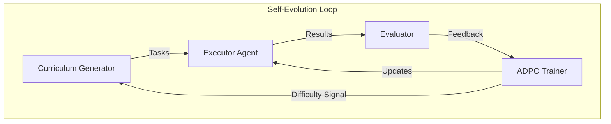
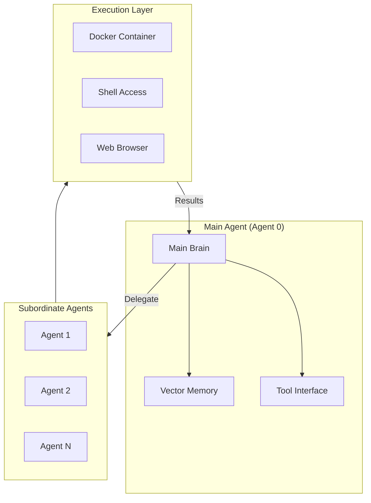

# Agent0 / Agent Zero Framework Integration Roadmap

## Overview

This roadmap covers **two distinct but related frameworks**:

1. **Agent0 (Research)**: Self-evolving agent framework using curriculum-executor co-evolution
2. **Agent Zero (Production)**: Hierarchical delegation system with persistent memory and Docker isolation

Both offer valuable patterns for evolving agent autonomy and self-improvement capabilities.

## Research Foundation

### Agent0 (Academic Research)
- **Paper**: arXiv:2511.16043 (UNC Chapel Hill, Salesforce, Stanford)
- **Key Innovation**: ADPO (Agentic Direct Preference Optimization) for self-evolution
- **Achievement**: Agents improve themselves using zero external data

### Agent Zero (Production Framework)
- **GitHub**: [agent0ai/agent-zero](https://github.com/agent0ai/agent-zero)
- **Key Innovation**: Hierarchical delegation with persistent vector memory
- **Achievement**: Fully autonomous agent system with Docker isolation

## Agent0 (Research) Deep Dive

### Core Architecture



### ADPO Training

**Agentic Direct Preference Optimization**:

```yaml
adpo_components:
  trajectory_collection:
    method: "on-policy rollouts"
    diversity: "curriculum-driven"

  preference_learning:
    comparison: "success vs failure trajectories"
    signal: "task completion + efficiency"

  policy_update:
    algorithm: "DPO variant"
    frequency: "after each curriculum batch"
```

**Key Insight**: The curriculum and executor co-evolve - as the executor improves, the curriculum generates harder tasks; as tasks get harder, the executor must improve.

### Curriculum-Executor Co-Evolution

```python
# Pseudocode for co-evolution loop
def coevolve(executor, curriculum, iterations=1000):
    for i in range(iterations):
        # Curriculum generates tasks at edge of capability
        tasks = curriculum.generate(
            difficulty=executor.current_level + 0.1,
            diversity=0.3
        )

        # Executor attempts tasks
        results = executor.attempt(tasks)

        # Evaluate and create preference pairs
        preferences = evaluate(results)

        # Update executor via ADPO
        executor.update(preferences)

        # Adjust curriculum based on success rate
        if executor.success_rate > 0.8:
            curriculum.increase_difficulty()
        elif executor.success_rate < 0.5:
            curriculum.decrease_difficulty()
```

## Agent Zero (Production) Deep Dive

### Core Architecture



### Hierarchical Delegation

```yaml
delegation_rules:
  main_agent:
    responsibilities:
      - "High-level planning"
      - "Task decomposition"
      - "Result synthesis"
      - "Memory management"

  subordinate_agents:
    responsibilities:
      - "Atomic task execution"
      - "Tool operation"
      - "Information gathering"

    spawning:
      trigger: "task_complexity > threshold"
      max_depth: 3
      max_concurrent: 5
```

### Persistent Vector Memory

```yaml
memory_architecture:
  short_term:
    type: "conversation buffer"
    retention: "session"

  long_term:
    type: "vector database"
    embedding: "text-embedding-ada-002"
    retention: "permanent"

  episodic:
    type: "timestamped events"
    consolidation: "daily"

  semantic:
    type: "knowledge graph"
    updates: "on new learning"
```

### Docker Isolation

```yaml
docker_config:
  base_image: "python:3.11-slim"

  security:
    network: "isolated"
    filesystem: "ephemeral"
    capabilities: "minimal"

  resources:
    memory: "2GB"
    cpu: "1 core"
    timeout: "300s"
```

## Integration Strategy

### Phase 1: Agent Zero Patterns (Immediate)

Integrate hierarchical delegation and memory patterns:

```yaml
integration_points:
  hierarchical_delegation:
    existing: "Task tool agent spawning"
    enhancement: "Add depth control, result aggregation"

  vector_memory:
    existing: "Memory MCP tools"
    enhancement: "Add semantic search, consolidation"

  docker_isolation:
    existing: "E2B sandboxes"
    enhancement: "Add local Docker option"
```

### Phase 2: ADPO Self-Improvement (Month 2)

Implement curriculum-based learning:

```yaml
learning_system:
  curriculum_generator:
    source: "/learn:curriculum command"
    enhancement: "Add difficulty tracking, success correlation"

  executor_feedback:
    source: "Task completion logs"
    enhancement: "Add preference pair generation"

  model_updates:
    approach: "Prompt optimization via DSPy"
    alternative: "Fine-tuning with ADPO"
```

### Phase 3: Full Co-Evolution (Month 3+)

Enable self-evolving agent capabilities:

```yaml
coevolution_system:
  components:
    - "Difficulty-adaptive curriculum"
    - "Success-rate tracking"
    - "Prompt/behavior optimization"
    - "Skill library expansion"

  triggers:
    improve: "success_rate > 0.9 for 10 tasks"
    escalate: "success_rate < 0.5 for 5 tasks"
```

## Implementation Phases

### Phase 1: Hierarchical Delegation (Week 1-2)
**Cost**: ~$0 (configuration only)

**Deliverables**:
- [ ] Add delegation depth control to Task tool
- [ ] Implement result aggregation patterns
- [ ] Create delegation monitoring
- [ ] Document delegation best practices

**Status**: NOT STARTED

### Phase 2: Memory Enhancement (Week 3-4)
**Cost**: ~$50/month (embedding API)

**Deliverables**:
- [ ] Implement vector similarity search
- [ ] Add memory consolidation scheduler
- [ ] Create semantic memory queries
- [ ] Build memory analytics

**Status**: NOT STARTED

### Phase 3: Curriculum Learning (Month 2)
**Cost**: ~$100/month (training runs)

**Deliverables**:
- [ ] Enhance `/learn:curriculum` with difficulty tracking
- [ ] Implement success correlation analysis
- [ ] Add preference pair generation
- [ ] Create learning progress dashboard

**Status**: NOT STARTED

### Phase 4: Self-Evolution (Month 3+)
**Cost**: ~$200/month (optimization runs)

**Deliverables**:
- [ ] Implement co-evolution loop
- [ ] Add automatic difficulty adjustment
- [ ] Create prompt optimization pipeline
- [ ] Build evolution metrics tracking

**Status**: NOT STARTED

## New Commands

### `/agent:delegate`

```yaml
command: /agent:delegate
description: "Delegate task with hierarchical control"
arguments:
  - name: task
    description: "Task to delegate"
    required: true
  - name: max_depth
    description: "Maximum delegation depth"
    default: 2
  - name: strategy
    description: "parallel | sequential | adaptive"
    default: "adaptive"
```

### `/agent:evolve`

```yaml
command: /agent:evolve
description: "Run self-evolution cycle"
arguments:
  - name: focus
    description: "Area to improve"
    required: true
  - name: iterations
    description: "Evolution iterations"
    default: 10
  - name: metric
    description: "Success metric"
    default: "task_completion"
```

### `/memory:semantic`

```yaml
command: /memory:semantic
description: "Query semantic memory"
arguments:
  - name: query
    description: "Semantic query"
    required: true
  - name: top_k
    description: "Number of results"
    default: 5
  - name: threshold
    description: "Similarity threshold"
    default: 0.7
```

## Cost Analysis

### Operational Costs

```yaml
memory_costs:
  embeddings:
    per_1k_tokens: "$0.0001"
    monthly_moderate_use: "$5-10"

  vector_storage:
    per_gb: "$0.25"
    typical_monthly: "$1-5"

learning_costs:
  curriculum_generation:
    per_task: "$0.01"
    monthly_active: "$30-50"

  preference_training:
    per_batch: "$5-10"
    monthly: "$50-100"
```

### Monthly Budget by Tier

| Feature | Light | Standard | Heavy |
|---------|-------|----------|-------|
| Delegation | $0 | $0 | $0 |
| Memory | $10 | $25 | $50 |
| Curriculum | $20 | $50 | $100 |
| Evolution | $50 | $100 | $200 |
| **Total** | **$80** | **$175** | **$350** |

## Success Metrics

### Delegation Metrics

```yaml
targets:
  delegation_success_rate: "> 95%"
  avg_delegation_depth: "< 2.5"
  result_aggregation_accuracy: "> 98%"
  delegation_overhead: "< 15%"
```

### Memory Metrics

```yaml
targets:
  retrieval_relevance: "> 90%"
  consolidation_compression: "> 80%"
  query_latency_ms: "< 500"
  memory_growth_rate: "sustainable"
```

### Evolution Metrics

```yaml
targets:
  success_rate_improvement: "> 5% per month"
  curriculum_difficulty_growth: "positive trend"
  skill_acquisition_rate: "> 3 per week"
  regression_rate: "< 2%"
```

### Track Weekly

```javascript
{
  // Delegation
  "delegation_tasks": 150,
  "avg_depth": 1.8,
  "success_rate": 0.96,

  // Memory
  "memories_stored": 5000,
  "retrieval_accuracy": 0.92,
  "consolidation_ratio": 0.85,

  // Evolution
  "curriculum_difficulty": 0.72,
  "success_trend": "+3%",
  "skills_learned": 5,
  "preference_pairs_generated": 200
}
```

## Integration Points

### Existing System Connections

```yaml
integrations:
  task_tool:
    current: "Agent spawning"
    enhancement: "Delegation depth control"

  memory_mcp:
    current: "Key-value storage"
    enhancement: "Vector similarity search"

  learn_commands:
    current: "/learn:skill, /learn:curriculum"
    enhancement: "ADPO integration"

  hooks_system:
    current: "Pre/post task hooks"
    enhancement: "Evolution triggers"
```

### New Components

```yaml
new_components:
  delegation_controller:
    purpose: "Manage hierarchical task delegation"
    interfaces: ["Task tool", "Agent coordination"]

  vector_memory:
    purpose: "Semantic memory storage and retrieval"
    interfaces: ["Memory MCP", "Embeddings API"]

  curriculum_engine:
    purpose: "Generate difficulty-appropriate tasks"
    interfaces: ["/learn:curriculum", "Skill library"]

  evolution_tracker:
    purpose: "Monitor and guide self-improvement"
    interfaces: ["All systems", "Metrics dashboard"]
```

## References

### Agent0 (Research)
- [Agent0 Paper (arXiv:2511.16043)](https://arxiv.org/abs/2511.16043)
- [ADPO Methodology](https://arxiv.org/abs/2511.16043#adpo)

### Agent Zero (Production)
- [Agent Zero GitHub](https://github.com/agent0ai/agent-zero)
- [Documentation](https://agent-zero.readthedocs.io/)
- [Docker Integration Guide](https://github.com/agent0ai/agent-zero/wiki/Docker)

---

**Key Takeaway**: Agent0/Agent Zero patterns enable true agent autonomy through hierarchical delegation, persistent memory, and self-evolution. Integration provides a path from reactive tool-using agents to proactive self-improving systems.
