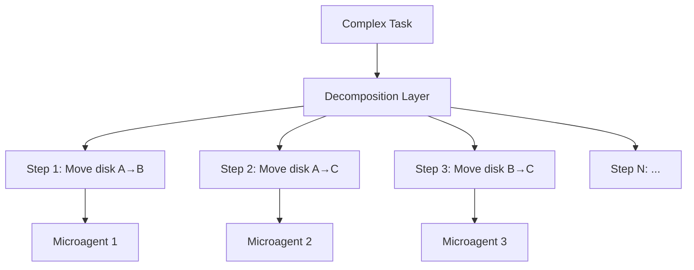
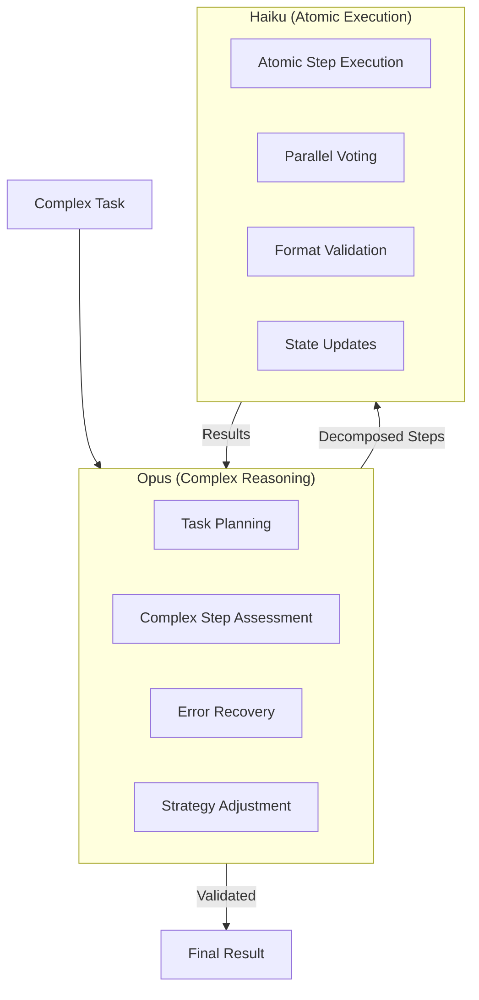

# MAKER Framework Integration Roadmap

## Overview

The **MAKER Framework** (Maximal Agent-Kernel Execution with Reliability) achieved a breakthrough result: solving a 20-disk Tower of Hanoi problem (1,048,576 steps) with **zero errors**. This roadmap details how to integrate MAKER's core techniques into the evolve framework using Claude's model ecosystem.

## Research Foundation

- **Source**: arXiv:2511.09030 (Cognizant AI Lab + UT Austin)
- **GitHub**: [bigdegenenergy/maker-framework](https://github.com/bigdegenenergy/maker-framework) (MIT License)
- **Key Achievement**: Perfect reliability on million-step deterministic tasks
- **Key Finding**: Smaller models (gpt-4.1-mini) achieve higher reliability-per-dollar than larger models

## Core Architecture Components

### 1. MAD (Maximal Agentic Decomposition)

**Principle**: Decompose tasks to the atomic level where m=1 (single instruction per microagent).



**Benefits**:
- Each microagent handles exactly ONE atomic operation
- Eliminates compounding errors across steps
- Enables parallel validation
- Clear success/failure criteria per step

### 2. First-to-Ahead-by-K Voting

**Principle**: Run k parallel agents; first result that achieves k-ahead consensus wins.

```yaml
voting_config:
  k_value: 3                    # Default for most tasks
  k_min_formula: "Θ(ln s)"      # Scales logarithmically with steps
  consensus_strategy: "first_to_k_ahead"
  tie_breaker: "semantic_consistency"
```

**How it works**:
1. Spawn k parallel microagents for same step
2. Each produces a candidate result
3. First result to achieve k confirmations (ahead by k) wins
4. Reduces error rate exponentially with k

**Claude Implementation**:
```javascript
// Parallel voting with Claude Code Task tool
[Single Message - K-Voting]:
  Task("Voter 1", "Execute step: Move disk from A to B. Return ONLY the action.", "haiku")
  Task("Voter 2", "Execute step: Move disk from A to B. Return ONLY the action.", "haiku")
  Task("Voter 3", "Execute step: Move disk from A to B. Return ONLY the action.", "haiku")
  // Validator aggregates and confirms consensus
```

### 3. Red-Flagging System

**Principle**: Automatically discard invalid responses before they propagate.

```yaml
red_flag_triggers:
  excessive_length:
    threshold: "2x expected_output_length"
    action: "discard_and_retry"

  format_violation:
    patterns: ["missing_required_field", "invalid_json", "wrong_schema"]
    action: "discard_and_retry"

  semantic_inconsistency:
    checks: ["state_violation", "impossible_action", "contradiction"]
    action: "discard_and_escalate"

  timeout:
    threshold_ms: 5000
    action: "discard_and_retry"
```

**Integration with Hooks**:
```bash
# Pre-validation hook
npx claude-flow@alpha hooks pre-validate --step-id "[step]" --expected-format "[schema]"

# Post-validation hook
npx claude-flow@alpha hooks post-validate --result "[result]" --red-flag-check true
```

### 4. Cost Scaling: Θ(s ln s)

**Key Insight**: MAKER achieves log-linear cost scaling, not linear or exponential.

```
For 1,000,000 steps:
- Naive approach: O(s²) = 10¹² operations (infeasible)
- MAKER approach: Θ(s ln s) = ~20,000,000 operations (tractable)
```

## Integration Strategy with Claude Ecosystem

### Model Tiering



### Opus Responsibilities

1. **Task Planning**
   - Analyze full task scope
   - Determine decomposition strategy
   - Identify complex steps requiring escalation
   - Set k-value based on task criticality

2. **Complex Step Assessment**
   - Identify steps with high error potential
   - Determine when to increase k-value
   - Handle ambiguous or edge cases
   - Validate semantic consistency across steps

3. **Error Recovery**
   - Analyze red-flagged steps
   - Determine retry vs. alternative approach
   - Adjust strategy based on failure patterns

### Haiku Responsibilities

1. **Atomic Step Execution**
   - Execute single decomposed instruction
   - Return structured result
   - Fast, parallel processing

2. **Parallel Voting**
   - Run as voting participant
   - Produce deterministic output
   - Enable consensus building

3. **Format Validation**
   - Check output schema
   - Verify state consistency
   - Flag anomalies

## Implementation Phases

### Phase 1: Foundation (Week 1-2)
**Cost**: ~$0 (configuration only)

**Deliverables**:
- [ ] Create `/sparc:decompose` command for MAD
- [ ] Implement basic k-voting with k=3
- [ ] Add red-flag validation hooks
- [ ] Configure Opus/Haiku routing rules

**Status**: NOT STARTED

### Phase 2: Core Integration (Week 3-4)
**Cost**: ~$50-100/month (increased API usage)

**Deliverables**:
- [ ] Implement step state tracking in memory
- [ ] Build consensus aggregation system
- [ ] Add adaptive k-value adjustment
- [ ] Create error recovery workflows

**Status**: NOT STARTED

### Phase 3: Optimization (Month 2)
**Cost**: ~$100-200/month

**Deliverables**:
- [ ] Implement dynamic k-value based on task complexity
- [ ] Add pattern learning for decomposition
- [ ] Build performance analytics
- [ ] Create batch optimization for similar steps

**Status**: NOT STARTED

### Phase 4: Advanced Features (Month 3+)
**Cost**: ~$50/month ongoing

**Deliverables**:
- [ ] Self-tuning k-values based on historical success
- [ ] Predictive red-flagging
- [ ] Cross-task pattern reuse
- [ ] Integration with neural training

**Status**: NOT STARTED

## New Commands

### `/sparc:decompose`

```yaml
command: /sparc:decompose
description: "MAD decomposition of complex task into atomic steps"
arguments:
  - name: task
    description: "Task to decompose"
    required: true
  - name: max_depth
    description: "Maximum decomposition depth"
    default: 10
  - name: k_value
    description: "Voting redundancy (default: 3)"
    default: 3
```

### `/sparc:execute-maker`

```yaml
command: /sparc:execute-maker
description: "Execute task using MAKER framework"
arguments:
  - name: task
    description: "Task to execute"
    required: true
  - name: model_planning
    description: "Model for planning (default: opus)"
    default: "opus"
  - name: model_execution
    description: "Model for atomic steps (default: haiku)"
    default: "haiku"
```

## Cost Analysis

### Per-Task Costs

```yaml
task_complexity:
  simple:
    steps: "< 100"
    k_value: 2
    opus_calls: 5
    haiku_calls: 200
    estimated_cost: "$0.05-0.10"

  moderate:
    steps: "100-1,000"
    k_value: 3
    opus_calls: 20
    haiku_calls: 3000
    estimated_cost: "$0.30-0.60"

  complex:
    steps: "1,000-10,000"
    k_value: 3
    opus_calls: 100
    haiku_calls: 30000
    estimated_cost: "$3-6"

  extreme:
    steps: "10,000-1,000,000"
    k_value: 3-5
    opus_calls: 500
    haiku_calls: 3_000_000
    estimated_cost: "$300-600"
```

### Monthly Budget Projections

```yaml
usage_tier:
  light:
    tasks_per_month: 100
    average_complexity: "moderate"
    estimated_monthly: "$30-60"

  standard:
    tasks_per_month: 500
    average_complexity: "moderate"
    estimated_monthly: "$150-300"

  heavy:
    tasks_per_month: 2000
    average_complexity: "mixed"
    estimated_monthly: "$600-1200"
```

## Success Metrics

### Reliability Metrics

```yaml
targets:
  atomic_step_success_rate: "> 99.9%"
  end_to_end_success_rate: "> 95%"
  red_flag_catch_rate: "> 99%"
  false_positive_rate: "< 1%"
```

### Performance Metrics

```yaml
targets:
  decomposition_time: "< 5s per 1000 steps"
  voting_latency: "< 2s per step"
  total_overhead: "< 20% vs naive"
  cost_per_successful_step: "< $0.001"
```

### Track Weekly

```javascript
{
  // Reliability
  "atomic_success_rate": 0.999,
  "e2e_success_rate": 0.96,
  "red_flags_caught": 47,
  "false_positives": 2,

  // Performance
  "avg_step_latency_ms": 1200,
  "voting_consensus_time_ms": 800,
  "total_steps_executed": 50000,

  // Cost
  "opus_tokens_used": 500000,
  "haiku_tokens_used": 15000000,
  "total_cost_usd": 45.50
}
```

## Integration Points

### Existing System Touchpoints

1. **Task Tool**: K-voting via parallel Task spawning
2. **Hooks System**: Red-flag validation pre/post execution
3. **Memory System**: Step state tracking and persistence
4. **Command Routing**: Route MAKER tasks to appropriate commands
5. **Agent Coordination**: Parallel voting coordination

### New System Components

1. **MAD Decomposer**: Breaks tasks into atomic steps
2. **Voting Aggregator**: Collects and validates k responses
3. **Red-Flag Validator**: Checks for invalid outputs
4. **Step State Manager**: Tracks execution progress
5. **Error Recovery Engine**: Handles failures gracefully

## References

- [MAKER Paper (arXiv:2511.09030)](https://arxiv.org/abs/2511.09030)
- [GitHub Repository](https://github.com/bigdegenenergy/maker-framework)
- [Tower of Hanoi Results](https://github.com/bigdegenenergy/maker-framework/results)

---

**Key Takeaway**: MAKER enables zero-error execution of million-step tasks by combining maximal decomposition, parallel voting, and aggressive error filtering. Integration with Claude's Opus/Haiku tiering provides optimal cost-performance balance.
