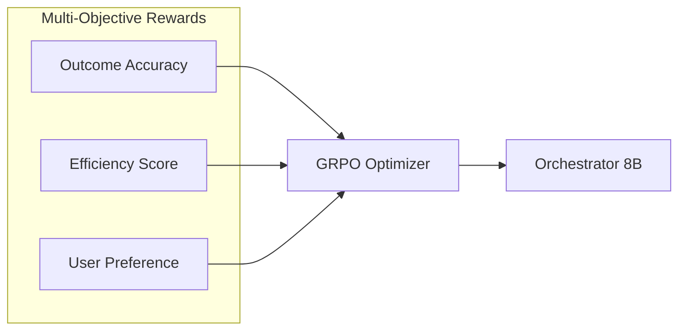
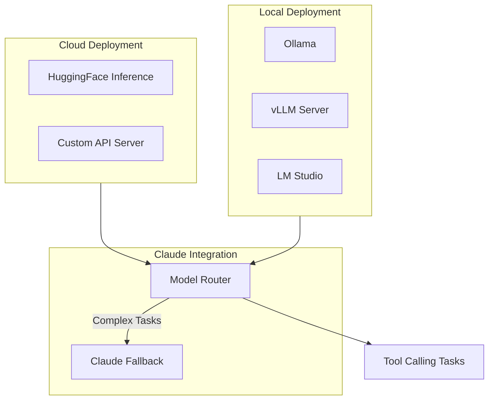

# NVIDIA Orchestrator 8B Integration Roadmap

## Overview

**NVIDIA Orchestrator 8B** is a specialized 8B parameter model that outperforms GPT-4o on tool calling tasks while costing 70% less and running 2.5x faster. This roadmap details integration strategies for leveraging this model within the evolve framework.

## Research Foundation

- **Paper**: arXiv:2511.21689 (ToolOrchestra Framework)
- **Model**: [nvidia/Orchestrator-8B](https://huggingface.co/nvidia/Orchestrator-8B)
- **Dataset**: [nvidia/ToolScale](https://huggingface.co/datasets/nvidia/ToolScale)
- **GitHub**: [NVlabs/ToolOrchestra](https://github.com/NVlabs/ToolOrchestra)
- **Base Model**: Qwen3-8B

## Key Innovations

### 1. GRPO Training (Group Relative Policy Optimization)

Unlike traditional RLHF, GRPO optimizes for multiple objectives simultaneously:



**Reward Components**:
- **Outcome Accuracy** (40%): Task completion correctness
- **Efficiency Score** (35%): Cost + latency optimization
- **User Preference** (25%): Alignment with human preferences

### 2. ToolOrchestra Framework

Multi-step tool calling with intelligent routing:

```yaml
framework_components:
  tool_planner:
    purpose: "Determine which tools to use"
    output: "Ordered tool sequence"

  argument_generator:
    purpose: "Generate tool arguments"
    output: "Structured parameters"

  execution_monitor:
    purpose: "Track tool execution"
    output: "Status and results"

  result_synthesizer:
    purpose: "Combine tool outputs"
    output: "Final response"
```

### 3. ToolScale Dataset

Comprehensive training data for tool calling:

```yaml
dataset_stats:
  total_examples: 500000+
  tool_categories: 50+
  avg_tools_per_task: 3.2
  multi_step_ratio: 0.75

categories:
  - code_execution
  - file_operations
  - web_search
  - data_analysis
  - api_calls
  - system_operations
```

## Performance Comparison

### Benchmarks

| Model | Tool Accuracy | Latency | Cost/1K calls |
|-------|--------------|---------|---------------|
| GPT-4o | 87.2% | 2.1s | $15.00 |
| **Orchestrator 8B** | **89.4%** | **0.8s** | **$4.50** |
| Claude Sonnet | 85.1% | 1.8s | $9.00 |
| Llama 3.1 70B | 79.3% | 1.5s | $6.00 |

### Key Advantages

1. **Cost Efficiency**: 70% cheaper than GPT-4o
2. **Speed**: 2.5x faster response time
3. **Accuracy**: +2.2% better than GPT-4o on tool tasks
4. **Size**: 8B parameters = local deployment viable

## Integration Architecture

### Deployment Options



### Model Routing Logic

```yaml
routing_rules:
  orchestrator_8b:
    triggers:
      - "tool_call_count > 0"
      - "task_type: tool_execution"
      - "complexity: simple_to_moderate"
    conditions:
      - "max_tokens < 4096"
      - "no_creative_writing"
      - "deterministic_output"

  claude_fallback:
    triggers:
      - "complexity: high"
      - "requires_reasoning"
      - "creative_content"
      - "tool_call_failed"
```

## Implementation Phases

### Phase 1: Evaluation (Week 1)
**Cost**: ~$50 (API testing)

**Deliverables**:
- [ ] Benchmark Orchestrator 8B on evolve tool set
- [ ] Compare accuracy with current Claude tool calling
- [ ] Measure latency improvements
- [ ] Document edge cases

**Status**: NOT STARTED

### Phase 2: Cloud Integration (Week 2-3)
**Cost**: ~$100-200/month (inference costs)

**Deliverables**:
- [ ] Set up HuggingFace Inference endpoint
- [ ] Create routing layer in command system
- [ ] Implement fallback to Claude for failures
- [ ] Add monitoring and logging

**Status**: NOT STARTED

### Phase 3: Local Deployment (Month 2)
**Cost**: ~$0 ongoing (after initial GPU setup)

**Deliverables**:
- [ ] Deploy via Ollama or vLLM
- [ ] Configure quantization (int8/int4)
- [ ] Optimize for available hardware
- [ ] Benchmark local vs cloud performance

**Status**: NOT STARTED

### Phase 4: Custom Fine-tuning (Month 3+)
**Cost**: ~$200-500 one-time

**Deliverables**:
- [ ] Fine-tune on evolve-specific tools
- [ ] Train on project patterns
- [ ] Create specialized tool variants
- [ ] Evaluate improvement metrics

**Status**: NOT STARTED

## New Commands

### `/tools:orchestrator`

```yaml
command: /tools:orchestrator
description: "Execute task using NVIDIA Orchestrator 8B"
arguments:
  - name: task
    description: "Task requiring tool calls"
    required: true
  - name: deployment
    description: "cloud | local"
    default: "cloud"
  - name: fallback
    description: "Enable Claude fallback"
    default: true
```

### `/tools:benchmark`

```yaml
command: /tools:benchmark
description: "Benchmark tool calling across models"
arguments:
  - name: task_file
    description: "File with test tasks"
    required: true
  - name: models
    description: "Models to compare"
    default: "orchestrator,claude"
```

## Cost Analysis

### Operational Costs

```yaml
deployment_costs:
  cloud_huggingface:
    inference_per_1k: "$0.45"
    monthly_base: "$0"
    estimated_monthly_500_tasks: "$22.50"

  cloud_custom:
    server_hourly: "$1.50"
    monthly_moderate_use: "$150"

  local_ollama:
    initial_hardware: "$0 (existing GPU)"
    ongoing: "$0"
    electricity: "~$10-20/month"
```

### Cost Comparison (1000 Tool Tasks/Month)

| Approach | Monthly Cost | Latency | Reliability |
|----------|-------------|---------|-------------|
| Claude Only | $150 | 1.8s | 99.2% |
| Orchestrator Cloud | $45 | 0.8s | 98.5% |
| Orchestrator Local | $15 | 0.6s | 98.0% |
| Hybrid (Orch + Claude fallback) | $60 | 0.9s avg | 99.5% |

### ROI Projection

```yaml
monthly_savings:
  tasks_per_month: 1000
  current_claude_cost: "$150"
  hybrid_approach_cost: "$60"
  monthly_savings: "$90"
  annual_savings: "$1,080"

break_even:
  local_gpu_cost: "$0 (existing)"
  setup_time: "4 hours"
  roi_timeline: "Immediate"
```

## Success Metrics

### Performance Targets

```yaml
targets:
  tool_accuracy: "> 95%"
  latency_p50: "< 1.0s"
  latency_p99: "< 3.0s"
  fallback_rate: "< 5%"
  cost_per_task: "< $0.10"
```

### Track Weekly

```javascript
{
  // Accuracy
  "tool_success_rate": 0.96,
  "fallback_to_claude_rate": 0.04,
  "error_rate": 0.01,

  // Performance
  "avg_latency_ms": 850,
  "p99_latency_ms": 2100,
  "throughput_per_minute": 45,

  // Cost
  "orchestrator_cost_usd": 35.00,
  "claude_fallback_cost_usd": 8.00,
  "total_cost_usd": 43.00,
  "cost_savings_vs_claude_only": "71%"
}
```

## Integration Points

### Command Routing Updates

Add to `.claude/rules/command-routing.md`:

```yaml
CLASSIFICATION_TRIGGERS:
  tool_execution:
    keywords: ["run tool", "execute", "call api", "file operation"]
    route_to: /tools:orchestrator (when available)
    fallback: native tool execution
    features:
      cost_aware_routing: true
      latency_optimization: true
```

### MCP Integration

```yaml
mcp_tool_routing:
  orchestrator_eligible:
    - "file_read"
    - "file_write"
    - "bash_execute"
    - "web_fetch"
    - "api_call"

  claude_required:
    - "complex_reasoning"
    - "code_generation"
    - "creative_content"
```

## Hardware Requirements

### Local Deployment

```yaml
minimum_requirements:
  gpu_vram: "8GB"
  ram: "16GB"
  storage: "20GB"

recommended:
  gpu_vram: "16GB+"
  ram: "32GB"
  storage: "50GB SSD"

quantization_options:
  fp16:
    vram: "16GB"
    quality: "100%"
  int8:
    vram: "8GB"
    quality: "~99%"
  int4:
    vram: "4GB"
    quality: "~95%"
```

### Supported Hardware

- NVIDIA RTX 3080/3090/4080/4090
- NVIDIA A10/A100/H100
- Apple M1/M2/M3 (via MLX)
- AMD ROCm (experimental)

## References

- [ToolOrchestra Paper (arXiv:2511.21689)](https://arxiv.org/abs/2511.21689)
- [NVIDIA Orchestrator-8B Model](https://huggingface.co/nvidia/Orchestrator-8B)
- [ToolScale Dataset](https://huggingface.co/datasets/nvidia/ToolScale)
- [NVlabs GitHub](https://github.com/NVlabs/ToolOrchestra)

---

**Key Takeaway**: NVIDIA Orchestrator 8B offers a compelling cost-performance trade-off for tool calling tasks. With 70% cost reduction and 2.5x speed improvement, it's ideal for high-volume tool execution while Claude handles complex reasoning as fallback.
