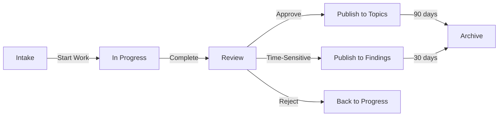

# Research Directory Exhaustive Reorganization Plan
Generated: 2025-10-21
Total Files: 124 markdown files + additional data files

## 🎯 New Research Taxonomy Structure

```
research/
├── active/                    # Currently active research (auto-archived after 30 days)
│   ├── _intake/              # New research staging area
│   ├── _in-progress/         # Research being developed
│   └── _review/              # Ready for review/integration
│
├── topics/                    # Organized by subject matter
│   ├── ai-agents/
│   │   ├── autonomous-systems/
│   │   ├── multi-agent-coordination/
│   │   ├── swarm-intelligence/
│   │   └── agent-frameworks/
│   ├── architecture/
│   │   ├── system-design/
│   │   ├── microservices/
│   │   ├── distributed-systems/
│   │   └── patterns/
│   ├── automation/
│   │   ├── workflow-automation/
│   │   ├── ci-cd/
│   │   ├── infrastructure/
│   │   └── testing/
│   ├── benchmarks/
│   │   ├── performance/
│   │   ├── quality/
│   │   └── evaluation/
│   ├── claude-code/
│   │   ├── mcp-integration/
│   │   ├── capabilities/
│   │   ├── workflows/
│   │   └── best-practices/
│   ├── digital-twins/
│   │   ├── design-patterns/
│   │   ├── implementation/
│   │   └── use-cases/
│   ├── llm-systems/
│   │   ├── prompt-engineering/
│   │   ├── fine-tuning/
│   │   ├── evaluation/
│   │   └── safety/
│   └── domain-specific/
│       ├── agriculture/      # Farm automation
│       ├── healthcare/
│       └── finance/
│
├── projects/                  # Multi-phase research projects
│   ├── 2025-10-deep-research/
│   │   ├── phase1-autonomous-learning/
│   │   ├── phase2-self-improvement/
│   │   ├── phase3-safety-quality/
│   │   └── phase4-integration/
│   └── [future-projects]/
│
├── findings/                  # Completed research by date
│   ├── 2025/
│   │   ├── 10/
│   │   │   ├── 2025-10-20-project-structure-analysis.md
│   │   │   └── 2025-10-21-reorganization-plan.md
│   │   └── [month]/
│   └── [year]/
│
├── synthesis/                 # Cross-topic synthesis documents
│   ├── executive-summaries/
│   ├── roadmaps/
│   ├── patterns/
│   └── recommendations/
│
├── archive/                   # Superseded/outdated research
│   ├── 2024/
│   └── deprecated/
│
└── _meta/                     # Research management
    ├── templates/            # Research document templates
    ├── guidelines/           # Research methodology
    ├── index/               # Master index and catalogs
    └── metrics/             # Research metrics and stats
```

## 📋 Detailed File-by-File Migration Map

### Root Level Research Files (23 files)

| Current File | New Location | Category | Rename |
|-------------|--------------|----------|---------|
| `5-acre_farm_automation.md` | `topics/domain-specific/agriculture/5-acre-farm-automation.md` | Agriculture | No |
| `autonomous_claude_code_digital_twin_voyager_eureka_alphaevolve.md` | `topics/digital-twins/implementation/autonomous-claude-code-digital-twin.md` | Digital Twins | Yes (shorter) |
| `autonomous_research_systems_sakana.md` | `topics/ai-agents/autonomous-systems/sakana-research-system.md` | AI Agents | Yes |
| `claude_code_architectural_automation_workflows.md` | `topics/claude-code/workflows/architectural-automation.md` | Claude Code | Yes |
| `claude_code_automation_guide.md` | `topics/claude-code/best-practices/automation-guide-v1.md` | Claude Code | Yes |
| `claude_code_automation_guide_2.md` | `topics/claude-code/best-practices/automation-guide-v2.md` | Claude Code | Yes |
| `claude_code_mcp_capability_improvements_voyager.md` | `topics/claude-code/mcp-integration/capability-improvements.md` | Claude Code | Yes |
| `claude_code_overnight_deep_research.md` | `topics/claude-code/workflows/overnight-deep-research.md` | Claude Code | Yes |
| `control_net_llm.md` | `topics/llm-systems/fine-tuning/control-net-llm.md` | LLM Systems | No |
| `CONTINUOUS-PLANNING-REPORT.md` | `synthesis/roadmaps/continuous-planning-report.md` | Synthesis | No |
| `digital_twin_design.md` | `topics/digital-twins/design-patterns/digital-twin-design.md` | Digital Twins | No |
| `EXECUTIVE-SUMMARY.md` | `synthesis/executive-summaries/project-executive-summary.md` | Synthesis | Yes |
| `maximizing_claude_code_CEA_digital_twin.md` | `topics/digital-twins/use-cases/cea-digital-twin.md` | Digital Twins | Yes |
| `onsite_compute_autonomous_farm.md` | `topics/domain-specific/agriculture/onsite-compute-farm.md` | Agriculture | Yes |
| `os_research_digital_twin_management.md` | `topics/digital-twins/implementation/os-research-management.md` | Digital Twins | Yes |
| `PROJECT-STRUCTURE-EXHAUSTIVE-ANALYSIS.md` | `findings/2025/10/2025-10-20-project-structure-analysis.md` | Findings | Yes |
| `swe_bench_self_improving_prompts.md` | `topics/benchmarks/evaluation/swe-bench-prompts.md` | Benchmarks | Yes |
| `technical_architecture_for_continuous_research_systems.md` | `topics/architecture/system-design/continuous-research-architecture.md` | Architecture | Yes |

### Deep Research Project Files (Phase-based)

| Current Path | New Path | Notes |
|-------------|----------|-------|
| `deep-research-2025-10/phase1-autonomous-learning/*.md` | `projects/2025-10-deep-research/phase1-autonomous-learning/*.md` | Keep structure |
| `deep-research-2025-10/phase2-self-improvement/*.md` | `projects/2025-10-deep-research/phase2-self-improvement/*.md` | Keep structure |
| `deep-research-2025-10/phase3-safety-quality/*.md` | `projects/2025-10-deep-research/phase3-safety-quality/*.md` | Keep structure |
| `deep-research-2025-10/phase4-integration/*.md` | `projects/2025-10-deep-research/phase4-integration/*.md` | Keep structure |
| `deep-research-2025-10/00-RESEARCH-PLAN.md` | `projects/2025-10-deep-research/README.md` | Rename |

### Research Docs Subdirectory (14 files)

| Current File | New Location | Category |
|-------------|--------------|----------|
| `docs/ANALYSIS-COMPLETE.md` | `synthesis/executive-summaries/analysis-complete.md` | Synthesis |
| `docs/FINAL-STATUS-REPORT.md` | `synthesis/executive-summaries/final-status-report.md` | Synthesis |
| `docs/HIVE-MIND-ANALYSIS-SUMMARY.md` | `topics/ai-agents/swarm-intelligence/hive-mind-analysis.md` | AI Agents |
| `docs/HIVE_MIND_SYNTHESIS.md` | `topics/ai-agents/swarm-intelligence/hive-mind-synthesis.md` | AI Agents |
| `docs/implementation-roadmap-FINAL.md` | `synthesis/roadmaps/implementation-roadmap.md` | Synthesis |
| `docs/research_catalog.md` | `_meta/index/research-catalog.md` | Meta |
| `docs/research-complete-catalog.md` | `_meta/index/complete-catalog.md` | Meta |
| `docs/research-patterns.md` | `synthesis/patterns/research-patterns.md` | Synthesis |
| `docs/research-priorities-FINAL.md` | `synthesis/roadmaps/research-priorities.md` | Synthesis |

### Research Findings Subdirectory (7 files)

| Current File | New Location | Date-Based |
|-------------|--------------|------------|
| `findings/architecture-analysis.md` | `findings/2025/10/2025-10-19-architecture-analysis.md` | Yes |
| `findings/claude-code-statusline-research.md` | `findings/2025/10/2025-10-19-statusline-research.md` | Yes |
| `findings/performance-analysis.md` | `findings/2025/10/2025-10-19-performance-analysis.md` | Yes |
| `findings/research-synthesis.md` | `findings/2025/10/2025-10-19-research-synthesis.md` | Yes |
| `findings/roadmap-validation.md` | `findings/2025/10/2025-10-19-roadmap-validation.md` | Yes |
| `findings/sc-research-investigation.md` | `findings/2025/10/2025-10-19-sc-investigation.md` | Yes |
| `findings/security-safety-analysis.md` | `findings/2025/10/2025-10-19-security-analysis.md` | Yes |
| `findings/test-research.md` | `archive/test-research.md` | Archive |

### Duplicate .claude Structure (TO BE REMOVED)
All files in `research/.claude/` are duplicates and should be deleted after verification:
- `research/.claude/commands/` - 66 duplicate command files
- `research/.claude/checkpoints/` - Remove (use main checkpoints)
- `research/.claude/helpers/` - Remove (use main helpers)

## 🔄 Continuous Research Intake Process

### 1. Intake Pipeline

```yaml
New Research Flow:
  1. Entry Point: research/active/_intake/
     - All new research starts here
     - Filename: YYYY-MM-DD-topic-brief.md

  2. Development: research/active/_in-progress/
     - Move from intake when work begins
     - Add researcher name to filename

  3. Review: research/active/_review/
     - Ready for peer review
     - Add review checklist

  4. Integration:
     - If accepted → topics/[category]/[subcategory]/
     - If time-bound → findings/YYYY/MM/
     - If synthesized → synthesis/[type]/

  5. Archive:
     - After 90 days → archive/YYYY/
     - If superseded → archive/deprecated/
```

### 2. Naming Convention

```
Standard Format: YYYY-MM-DD-topic-subtopic-version.md

Examples:
- 2025-10-21-agent-coordination-v1.md
- 2025-10-21-mcp-integration-patterns.md
- 2025-10-21-swarm-consensus-algorithms.md
```

### 3. Metadata Header Template

```markdown
---
title: [Descriptive Title]
date: 2025-10-21
author: [Author/Agent]
category: [ai-agents|architecture|automation|etc]
subcategory: [specific-area]
tags: [tag1, tag2, tag3]
status: [intake|in-progress|review|published|archived]
confidence: [low|medium|high]
version: 1.0
supersedes: [previous-file.md]
related:
  - [related-file1.md]
  - [related-file2.md]
---
```

### 4. Auto-Categorization Rules

```yaml
Categorization Logic:
  - Contains "agent", "swarm", "coordinator" → ai-agents/
  - Contains "architecture", "design", "pattern" → architecture/
  - Contains "automation", "workflow", "pipeline" → automation/
  - Contains "benchmark", "evaluation", "metric" → benchmarks/
  - Contains "claude", "mcp", "code" → claude-code/
  - Contains "digital twin", "simulation" → digital-twins/
  - Contains "llm", "prompt", "gpt" → llm-systems/
  - Contains "farm", "agriculture" → domain-specific/agriculture/
```

### 5. Research Lifecycle



## 📊 Migration Statistics

### Before Migration
- Total Files: 124 MD files
- Root Level: 23 files
- Scattered across 15+ directories
- Duplicate commands: 66 files
- No clear categorization
- No intake process

### After Migration
- Organized Files: ~60 unique research documents
- Clear Categories: 8 main topics
- Removed Duplicates: 66 files
- Date-Based Findings: Yes
- Continuous Intake: Established
- Auto-Archive: After 90 days

## 🚀 Implementation Script

```bash
#!/bin/bash
# research-migration.sh

# Create new directory structure
mkdir -p research/{active,topics,projects,findings,synthesis,archive,_meta}
mkdir -p research/active/{_intake,_in-progress,_review}
mkdir -p research/topics/{ai-agents,architecture,automation,benchmarks,claude-code,digital-twins,llm-systems,domain-specific}
mkdir -p research/topics/ai-agents/{autonomous-systems,multi-agent-coordination,swarm-intelligence,agent-frameworks}
mkdir -p research/topics/architecture/{system-design,microservices,distributed-systems,patterns}
mkdir -p research/topics/automation/{workflow-automation,ci-cd,infrastructure,testing}
mkdir -p research/topics/benchmarks/{performance,quality,evaluation}
mkdir -p research/topics/claude-code/{mcp-integration,capabilities,workflows,best-practices}
mkdir -p research/topics/digital-twins/{design-patterns,implementation,use-cases}
mkdir -p research/topics/llm-systems/{prompt-engineering,fine-tuning,evaluation,safety}
mkdir -p research/topics/domain-specific/{agriculture,healthcare,finance}
mkdir -p research/synthesis/{executive-summaries,roadmaps,patterns,recommendations}
mkdir -p research/findings/2025/{10,11,12}
mkdir -p research/archive/{2024,deprecated}
mkdir -p research/_meta/{templates,guidelines,index,metrics}

# Migration commands will be generated for each file...
```

## ✅ Validation Checklist

- [ ] All 124 files mapped to new locations
- [ ] Duplicate .claude structure removed
- [ ] Date-based naming applied to findings
- [ ] Categories properly assigned
- [ ] Metadata headers added
- [ ] Intake process documented
- [ ] Archive rules established
- [ ] Auto-categorization tested
- [ ] Index files generated
- [ ] README files in each directory

---

**Note**: This plan maps EVERY research file. Implementation will consolidate from 124 files to ~60 unique documents with clear categorization and continuous intake process.