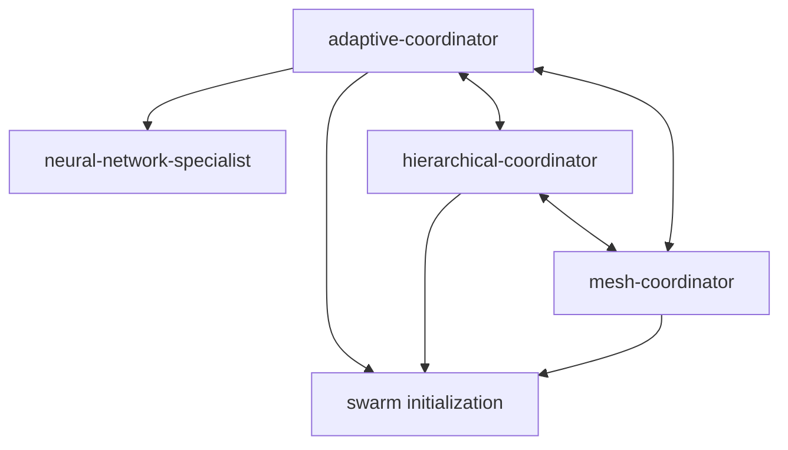
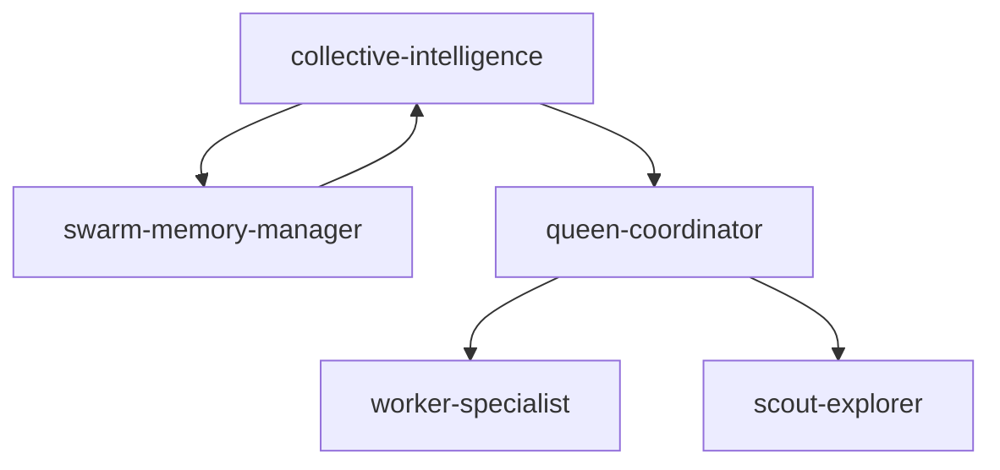
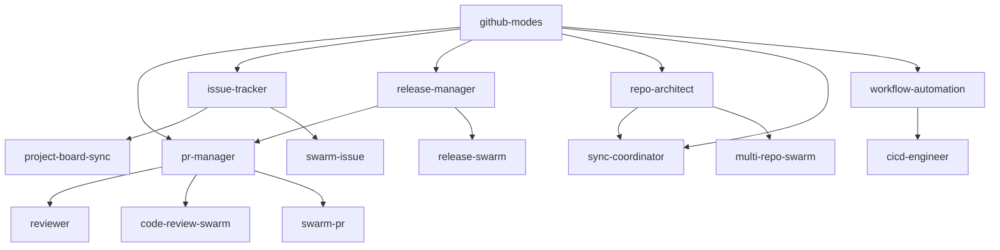
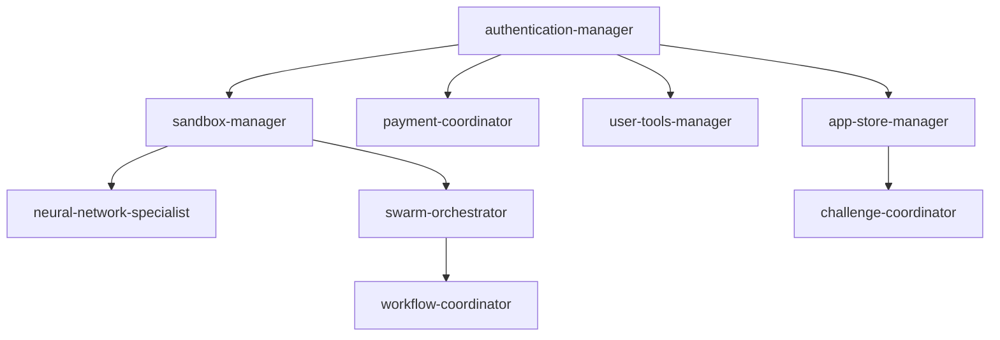
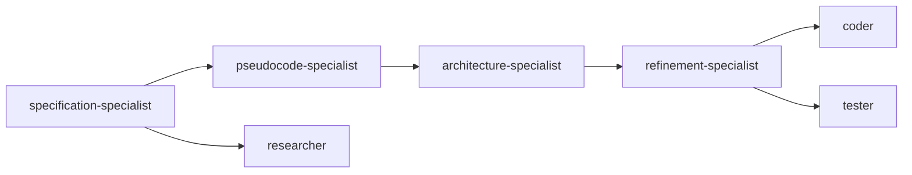

# Agent Dependency Graph

Visual representation of dependencies between all 78 agents.

## High-Level Dependency Layers

```
┌─────────────────────────────────────────────────────────────────────┐
│                          USER REQUESTS                              │
└─────────────────────────────────────────────────────────────────────┘
                                 ↓
┌─────────────────────────────────────────────────────────────────────┐
│                       LAYER 5: META (10)                            │
├─────────────────────────────────────────────────────────────────────┤
│  SPARC Methodology:                                                 │
│  specification → pseudocode → architecture → refinement             │
│                                                                     │
│  Planning: goal-planner → code-goal-planner                        │
│  Reasoning: reasoning-agent, templates                             │
│  Templates: 9 reusable patterns                                    │
└─────────────────────────────────────────────────────────────────────┘
                                 ↓
┌─────────────────────────────────────────────────────────────────────┐
│              LAYER 4: INTEGRATION (22)                              │
├─────────────────────────────────────────────────────────────────────┤
│  GITHUB (13):                                                       │
│  github-modes → pr-manager, issue-tracker, release-manager         │
│              → repo-architect, sync-coordinator                     │
│              → workflow-automation + swarm coordinators             │
│                                                                     │
│  PLATFORM (9):                                                      │
│  authentication-manager → sandbox-manager → neural-network         │
│                        → swarm-orchestrator → workflow-coordinator  │
│                        → app-store, challenges, payments, user-tools│
└─────────────────────────────────────────────────────────────────────┘
                                 ↓
┌─────────────────────────────────────────────────────────────────────┐
│              LAYER 3: COORDINATION (20)                             │
├─────────────────────────────────────────────────────────────────────┤
│  SWARM TOPOLOGIES (3): [CRITICAL]                                  │
│  adaptive-coordinator ⇄ hierarchical-coordinator ⇄ mesh-coordinator│
│                                                                     │
│  HIVE MIND (5): [CRITICAL]                                         │
│  collective-intelligence ← queen-coordinator → worker-specialist    │
│  swarm-memory-manager ← collective-intelligence                     │
│  scout-explorer → queen-coordinator                                 │
│                                                                     │
│  CONSENSUS (6): [CRITICAL]                                         │
│  raft-manager, byzantine-coordinator, gossip-coordinator            │
│  quorum-manager, crdt-synchronizer                                  │
│                                                                     │
│  PERFORMANCE (6):                                                   │
│  performance-monitor → benchmarker, load-balancer                   │
│  resource-allocator ← load-balancer                                 │
│  topology-optimizer ← adaptive-coordinator                          │
│  benchmark-suite → performance-benchmarker                          │
│                                                                     │
│  SECURITY (1):                                                      │
│  security-manager (enforces policies)                              │
└─────────────────────────────────────────────────────────────────────┘
                                 ↓
┌─────────────────────────────────────────────────────────────────────┐
│              LAYER 2: SPECIALIZED (43)                              │
├─────────────────────────────────────────────────────────────────────┤
│  Analysis (2): code-analyzer, code-quality-analyzer                 │
│  Architecture (1): system-architect                                 │
│  Backend (1): backend-api-developer                                 │
│  DevOps (1): cicd-engineer                                          │
│  Documentation (1): api-documentation-specialist                    │
│  ML (1): ml-model-specialist                                        │
│  Mobile (1): react-native-specialist                                │
│  Neural (1): safla-neural-specialist                                │
│  Scaffolding (1): template-generator                                │
│  Testing (2): tdd-london-swarm, production-validator                │
│                                                                     │
│  All specialized agents depend on CORE layer                        │
└─────────────────────────────────────────────────────────────────────┘
                                 ↓
┌─────────────────────────────────────────────────────────────────────┐
│                    LAYER 1: CORE (5)                                │
├─────────────────────────────────────────────────────────────────────┤
│  researcher → planner → coder ⇄ tester                              │
│                           ↓                                         │
│                        reviewer                                     │
│                                                                     │
│  FOUNDATION: All agents above depend on these 5                     │
└─────────────────────────────────────────────────────────────────────┘
```

## Core Agent Dependencies (Layer 1)


**Dependencies**:
- `researcher` → `planner` (provides context)
- `planner` → `coder` (task breakdown)
- `coder` ⇄ `tester` (bidirectional: implementation ↔ testing)
- `coder` → `reviewer` (code review)
- `tester` → `reviewer` (test review)

**No external dependencies** - these are the foundation.

## Specialized Agent Dependencies (Layer 2)

### Analysis Cluster
```
code-analyzer → reviewer
code-quality-analyzer → reviewer, code-analyzer
```

### Architecture Cluster
```
system-architect → planner, researcher
```

### Backend Development Cluster
```
backend-api-developer → coder, system-architect
```

### DevOps Cluster
```
cicd-engineer → github-modes, coder
```

### Documentation Cluster
```
api-documentation-specialist → backend-api-developer, system-architect
```

### ML/Neural Cluster
```
ml-model-specialist → neural-network-specialist, coder
safla-neural-specialist → neural-network-specialist
```

### Mobile Development Cluster
```
react-native-specialist → coder, system-architect
```

### Testing Cluster
```
tdd-london-swarm → tester, coder, planner
production-validator → tester, reviewer, cicd-engineer
```

## Coordination Agent Dependencies (Layer 3)

### Swarm Topology Dependencies



**Critical Path**:
- All 3 swarm coordinators can transition between each other
- `adaptive-coordinator` uses neural networks for optimization
- All depend on `swarm initialization` MCP tool

### Hive Mind Dependencies



**Critical Path**:
- `collective-intelligence-coordinator` is the central hub
- Bidirectional dependency with `swarm-memory-manager`
- `queen-coordinator` manages workers and scouts
- Memory synchronization is critical for coordination

### Consensus Protocol Dependencies

```
byzantine-coordinator → swarm-init
raft-manager → swarm-init
gossip-coordinator → swarm-init
quorum-manager → swarm-init, raft-manager
crdt-synchronizer → swarm-init, memory-manager
```

**Notes**:
- All consensus protocols need swarm initialization
- Can work independently or in combination
- Byzantine + Raft for critical decisions
- Gossip for lightweight coordination

### Performance Dependencies

```
performance-monitor → swarm-monitor (MCP)
performance-benchmarker → swarm-monitor
load-balancer → performance-monitor, resource-allocator
resource-allocator → performance-monitor, load-balancer
topology-optimizer → adaptive-coordinator, performance-monitor
benchmark-suite → performance-benchmarker
```

**Critical Path**:
- `performance-monitor` is the foundation
- Bidirectional between `load-balancer` ⇄ `resource-allocator`
- `topology-optimizer` feeds into `adaptive-coordinator`

### Security Dependencies

```
security-manager → swarm-init, all coordination agents
```

**Notes**:
- Cross-cutting concern
- Enforces policies across all agents
- Critical for production deployments

## GitHub Agent Dependencies (Layer 4)



**Hub Pattern**:
- `github-modes` is the central orchestration hub
- All GitHub agents depend on it
- Swarm agents coordinate specific workflows
- Integration with specialized agents (reviewer, cicd-engineer)

## Platform Agent Dependencies (Layer 4)



**Platform Foundation**:
- `authentication-manager` is the foundation
- `sandbox-manager` enables cloud execution
- `swarm-orchestrator` coordinates cloud swarms
- All Flow Nexus services depend on auth

## Meta Agent Dependencies (Layer 5)

### SPARC Methodology



**SPARC Flow**:
- Sequential methodology phases
- Each phase depends on previous
- Integration with core agents

### Planning Agents

```
goal-planner → planner
code-goal-planner → goal-planner, planner
reasoning-goal-planner → goal-planner, reasoning-agent
```

### Templates

```
All template agents → their corresponding agent types
(e.g., sparc-coordinator-template → SPARC specialists)
```

## Critical Dependency Paths

### Path 1: Core Development
```
researcher → planner → coder → tester → reviewer
```
**Usage**: Standard development workflow

### Path 2: SPARC Methodology
```
specification → pseudocode → architecture → refinement → completion
                                                           (core agents)
```
**Usage**: Systematic TDD development

### Path 3: GitHub PR Workflow
```
github-modes → pr-manager → code-review-swarm → reviewer → coder
```
**Usage**: Pull request management

### Path 4: Swarm Coordination
```
swarm-init → adaptive-coordinator → hive-mind → specialized agents
```
**Usage**: Multi-agent orchestration

### Path 5: Cloud Execution
```
authentication → sandbox → neural-network → swarm-orchestrator → workflow
```
**Usage**: Distributed cloud computing

## Dependency Metrics

### Agent Types by Dependencies

| Dependency Count | Agent Count | Examples |
|------------------|-------------|----------|
| **0 deps** (Foundation) | 5 | Core 5 agents |
| **1-2 deps** (Simple) | 23 | Most specialized agents |
| **3-4 deps** (Moderate) | 31 | Coordination agents |
| **5+ deps** (Complex) | 19 | Integration agents, swarm coordinators |

### Most Depended Upon (Critical Agents)

| Agent | Dependent Count | Priority |
|-------|----------------|----------|
| `coder` | ~35 | CRITICAL |
| `planner` | ~28 | CRITICAL |
| `tester` | ~20 | CRITICAL |
| `reviewer` | ~18 | CRITICAL |
| `researcher` | ~15 | CRITICAL |
| `github-modes` | 13 | CRITICAL |
| `adaptive-coordinator` | ~12 | CRITICAL |
| `collective-intelligence` | ~8 | CRITICAL |
| `swarm-memory-manager` | ~7 | CRITICAL |

### Isolated Agents (No Dependencies)

- `template-generator`
- Most template agents (by design)
- Some reasoning agents

## Dependency Resolution Order

For migration or initialization:

1. **Wave 1**: Core 5 agents (no dependencies)
2. **Wave 2**: Simple specialized agents (1-2 deps on core)
3. **Wave 3**: Coordination infrastructure (swarm, consensus)
4. **Wave 4**: Complex specialized agents (multiple deps)
5. **Wave 5**: Integration agents (GitHub, Platform)
6. **Wave 6**: Meta agents (SPARC, planning, templates)

## Circular Dependencies

### Identified Circles

1. **coder ⇄ tester** (intentional, development cycle)
2. **load-balancer ⇄ resource-allocator** (intentional, optimization loop)
3. **collective-intelligence ⇄ swarm-memory-manager** (intentional, memory sync)
4. **Swarm coordinators**: adaptive ⇄ hierarchical ⇄ mesh (intentional, topology switching)

**Note**: All circular dependencies are intentional design patterns, not bugs.

## Dependency Validation

### Validation Rules

1. **No missing dependencies**: All referenced agents must exist
2. **No broken chains**: Dependency paths must be resolvable
3. **Layer integrity**: Lower layers can't depend on higher layers
4. **Circular detection**: Only intentional circles allowed

### Validation Script

```bash
# Check for broken dependencies
./scripts/validate-agent-dependencies.sh

# Expected output: All dependencies resolved
```

## Visual Dependency Tree (Top 20 Most Connected)

```
coder (35 dependents)
├── backend-api-developer
├── react-native-specialist
├── tdd-london-swarm
├── sparc-refinement
├── 31 more...
│
planner (28 dependents)
├── system-architect
├── code-goal-planner
├── sparc-pseudocode
├── 25 more...
│
tester (20 dependents)
├── production-validator
├── tdd-london-swarm
├── sparc-refinement
├── 17 more...
│
reviewer (18 dependents)
├── code-analyzer
├── code-quality-analyzer
├── code-review-swarm
├── 15 more...
│
github-modes (13 dependents)
├── pr-manager
├── issue-tracker
├── release-manager
├── repo-architect
├── sync-coordinator
├── workflow-automation
├── 7 swarm agents...
```

## Dependency Impact Analysis

### Impact of Core Agent Changes

If you modify a **core agent**, it affects:
- All specialized agents (43)
- All coordination agents that use specialized agents (~15)
- GitHub agents that use specialized agents (~8)
- Platform agents that use specialized agents (~5)
- SPARC methodology agents (~4)

**Total Impact**: ~75 agents potentially affected

### Impact of Coordination Agent Changes

If you modify a **swarm coordinator**, it affects:
- Other swarm coordinators (2-3)
- Performance optimizers (~4)
- Hive mind agents (~3)
- GitHub swarm agents (~5)
- Platform orchestrators (~2)

**Total Impact**: ~15-17 agents potentially affected

### Impact of Specialized Agent Changes

If you modify a **specialized agent**, it affects:
- Usually 0-3 other specialized agents
- Specific meta agents that use it (~1-2)

**Total Impact**: ~1-5 agents potentially affected

---

**Last Updated**: 2025-10-20
**Version**: 1.0
**Agents Analyzed**: 78
**Dependencies Mapped**: ~250
