# Enforcement Gate Architecture Design

## Problem Statement

Claude Code hooks only support:
- `PreToolUse` - Before a tool executes
- `PostToolUse` - After a tool executes
- `PreCompact` - Before context compaction
- `Stop` - When assistant stops

**CRITICAL GAP**: No `PreMessage` or `PreResponse` hook exists. Claude starts responding immediately without any enforcement checkpoint.

## Solution: Multi-Layer Enforcement Strategy

### Layer 1: Behavioral Enforcement (CLAUDE.md)
**Coverage**: 100% of messages (advisory)
**Mechanism**: Strict rules in CLAUDE.md that Claude commits to following

```yaml
MANDATORY_FIRST_ACTIONS:
  1. Check user intent classification
  2. Consult /sc:pm for routing decision
  3. Use TodoWrite for >2 step tasks
  4. NEVER create markdown files unless explicitly requested
  5. NEVER assume task completion - always verify
```

### Layer 2: Tool-Level Gates (PreToolUse)
**Coverage**: 100% of tool operations (enforced)
**Mechanism**: Enhanced PreToolUse hooks

```yaml
ENHANCED_PRETOOLUSE:
  Write|Edit|MultiEdit:
    - Block if path is root folder
    - Block if creating .md without explicit request
    - Block if no TodoWrite preceded complex task

  Bash:
    - Require pre-validation for destructive commands
    - Block force flags without confirmation

  Task:
    - Log agent spawning for coordination
    - Validate agent type against task requirements
```

### Layer 3: Post-Action Validation (PostToolUse)
**Coverage**: 100% of tool completions (enforced)
**Mechanism**: Verification hooks after tool execution

```yaml
ENHANCED_POSTTOOLUSE:
  Write|Edit|MultiEdit:
    - Verify file was actually created/modified
    - Check for lint/typecheck if code file
    - Update memory with change record

  Bash:
    - Capture and analyze output
    - Detect errors and failures
    - Update task status
```

### Layer 4: External Enforcement (Git/CI)
**Coverage**: All committed code (enforced)
**Mechanism**: Git hooks and GitHub Actions

```yaml
GIT_PRECOMMIT:
  - No orphan markdown files in root
  - No TODO comments in committed code
  - All tests pass
  - Lint checks pass

GITHUB_ACTIONS:
  - PR validation against RULES.md
  - Automated code review
  - Test coverage requirements
```

### Layer 5: Session Lifecycle Gates
**Coverage**: Session boundaries (enforced)
**Mechanism**: Stop and PreCompact hooks

```yaml
SESSION_GATES:
  PreCompact:
    - Save context to memory
    - Export task state
    - Document incomplete work

  Stop:
    - Verify all tasks completed or documented
    - Clean up temporary files
    - Generate session summary
```

## Implementation Architecture

```mermaid
flowchart TB
    User["👤 USER MESSAGE"]

    subgraph L1["LAYER 1: BEHAVIORAL GATE (CLAUDE.md)"]
        L1a["1. Classify: brainstorm|task|research|implement|analyze"]
        L1b["2. Consult: FLAGS.md for auto-activation triggers"]
        L1c["3. Route: /sc:pm or appropriate command"]
        L1d["4. Plan: TodoWrite if >2 steps"]
    end

    subgraph L2["LAYER 2: TOOL GATE (PreToolUse hooks)"]
        L2a["Write/Edit: Block root folder, block .md spam"]
        L2b["Bash: Validate commands, block destructive"]
        L2c["Task: Log spawning, validate agent selection"]
    end

    Exec["⚙️ TOOL EXECUTION"]

    subgraph L3["LAYER 3: VALIDATION GATE (PostToolUse hooks)"]
        L3a["Verify success/failure"]
        L3b["Update memory and task status"]
        L3c["Run quality checks"]
    end

    subgraph L4["LAYER 4: EXTERNAL GATE (Git/CI)"]
        L4a["Pre-commit hooks validate"]
        L4b["GitHub Actions enforce"]
    end

    subgraph L5["LAYER 5: SESSION GATE (Stop/PreCompact)"]
        L5a["Save state, cleanup, verify completion"]
    end

    User --> L1 --> L2 --> Exec --> L3 --> L4 --> L5
```



## Enforcement Coverage Targets

| Layer | Current | Target | Mechanism |
|-------|---------|--------|-----------|
| L1: Behavioral | 0% | 80% | CLAUDE.md rules |
| L2: Tool Gate | 42% | 95% | Enhanced PreToolUse |
| L3: Validation | 30% | 90% | Enhanced PostToolUse |
| L4: External | 10% | 85% | Git hooks + CI |
| L5: Session | 60% | 95% | Stop/PreCompact |
| **OVERALL** | **28%** | **89%** | Multi-layer |

## Key Behavioral Commitments

### NEVER DO (Absolute Prohibitions)
1. ❌ NEVER create markdown files unless explicitly requested
2. ❌ NEVER save files to root folder (use appropriate subdirectories)
3. ❌ NEVER assume a task is complete without verification
4. ❌ NEVER start implementing without consulting available commands
5. ❌ NEVER skip TodoWrite for tasks with >2 steps

### ALWAYS DO (Mandatory Actions)
1. ✅ ALWAYS classify the request type first
2. ✅ ALWAYS check FLAGS.md for auto-activation triggers
3. ✅ ALWAYS use TodoWrite to plan tasks
4. ✅ ALWAYS verify task completion with tests or checks
5. ✅ ALWAYS consult existing commands before custom solutions

### PREFER (Strong Recommendations)
1. 📌 PREFER existing commands over ad-hoc solutions
2. 📌 PREFER /sc:pm for complex or ambiguous requests
3. 📌 PREFER agents for specialized tasks
4. 📌 PREFER memory for context persistence
5. 📌 PREFER parallel operations over sequential

## Request Classification Matrix

| Request Type | Triggers | Route To | Example |
|-------------|----------|----------|---------|
| Vague/Discovery | "maybe", "thinking", "not sure" | /sc:brainstorm | "I want to build something" |
| Task/Implementation | "implement", "create", "add" | /sc:task or /sc:implement | "Add user authentication" |
| Analysis | "analyze", "review", "check" | /sc:analyze | "Review code quality" |
| Research | "investigate", "explore", "find" | /sc:research | "Research best practices" |
| Documentation | "document", "explain" | /sc:document | "Document this API" |
| Troubleshooting | "fix", "debug", "error" | /sc:troubleshoot | "Fix this bug" |
| Architecture | "design", "architect" | /sc:design | "Design the system" |
| Testing | "test", "verify" | /sc:test | "Write tests for this" |
| Multi-Domain | crosses categories | /sc:pm | Complex requests |

## Phased Implementation Plan

### Phase 1: Immediate (This Session)
- [x] Document enforcement architecture
- [ ] Update CLAUDE.md with behavioral commitments
- [ ] Enhance PreToolUse hooks for file blocking
- [ ] Add PostToolUse verification hooks

### Phase 2: Week 1
- [ ] Implement enhanced permission system
- [ ] Create git pre-commit hooks
- [ ] Add workspace cleanup automation
- [ ] Test and validate Layer 2 gates

### Phase 3: Week 2-3
- [ ] GitHub Actions integration
- [ ] Full CI/CD enforcement
- [ ] Memory coordination for multi-session
- [ ] Document and train on new workflow

### Phase 4: Ongoing
- [ ] Monitor enforcement metrics
- [ ] Iterate on rules based on experience
- [ ] Expand agent auto-selection
- [ ] Optimize for common patterns
